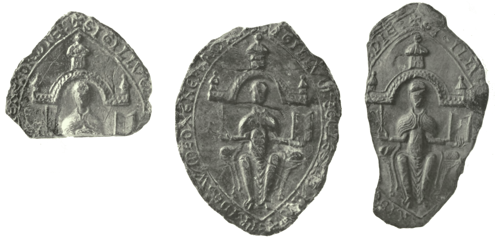

# The Unity of Alexander's Career and His Literary Works

When Alexander Neckam became the abbot of St Mary’s abbey in Cirencester in 1213, a position he held until his death in 1217 [@knowles:2001heads, pp. 1:159–60, with corrections at 1:278], he became the head of an organization that was very much tied up with the cares of the world; a powerful figure who was also lord of the manor, by royal prerogative [on the early relationship between the abbots and the townspeople, see @rollison:2011commune, chap. 1; @fuller:1884cirencester]. He was the sixth to hold this position since the reconstitution of the abbey by Henry I in 1117 [on the abbey's early history, see @wilkinson:1998cirencester; @evans:1993cirencester]. With perhaps forty canons resident, Cirencester was one of the largest Augustinian foundations in England [@knowles:1948religious, p. 2:259]. Alexander was an important administrator, and there is an essential unity between Alexander Neckam's many literary works and his career as a teacher, Augustinian canon, and abbot.

## Augustinians and their books

What did it mean to have an abbot of an Augustinian abbey who also had an active literary career? Among the English Augustinians in the early thirteenth century, there are few examples:

The Rule of St Augustine is maddeningly unspecific, and this is no less the case in its discussion of intellectual persuits. There are only two passages relating to books or reading in the *Ordo Monasterii* after an early discussion of the lessons for the offices:

>| Operentur a mane usque ad sextam,
>| et a sexta usque ad nonam uacent lectioni,
>| et ad nonam reddant codice.

>| Let them work from early morning till noon
>| and take leisure for reading from noon till three,
>| and at three o'clock return the books. [*Ordo Monasterii* 3, translated by @lawless:1987augustine, 74–75]

---

>| Sedentes ad mensam taceant, audientes lectionem.

>| When seated at table,
>| they are to be silent and listen to the reading. [*Ordo Monasterii* 7, translated by @lawless:1987augustine, 76–77]

The *Praeceptum* is a little more specific, but still has little to say:

>| Et nolite cantare, nisi quod legitis esse cantandum;
>| quod autem non it a scriptum est ut cantetur, non cantetur.

>| Keep to the prescribed text when you sing;
>| avoid texts which are not suited for singing. [*Praeceptum* 2.4, translated by @lawless:1987augustine, 84–85]

---

>| Cum acceditis ad mensam, donec inde surgatis,
>| quod uobis secundum consuetudinem legitur,
>| sine tumultu et contentionibus audite.

>| Listen to the customary reading
>| from the beginning to the end of the meal
>| without commotion or arguments. [*Praeceptum* 3.2, translated by @lawless:1987augustine, 84–85]

---

>| Siue autem qui cellario, siue qui uestibus,
>| siue qui codicibus praeponuntur,
>| sine murmure seruiant fratribus suis.
>| Codices certa hora singulis diebus petantur;
>| extra horam qui petierit, non accipiat.

>| Those responsible for food, clothing, or books
>| are to serve their brothers without grumbling.
>| Books are to be requested at a definite hour each day;
>| requests made at other times will be denied. [*Praeceptum* 4.9–10, translated by @lawless:1987augustine, 96–97]

Webber and Watson point out an attempt to determine precisely what this means in the *Colloquium magistri et discipuli in regulam beati Augustini de uita clericorum* (or *Bridlington Dialogue*), based on Richard of St Victor's *De questionibus regule sancti Augustini solutis* [@webber:1998libraries, p. xxi; from @lawson:1960bridlington, p. 162; Richard's text is edited in @colker:1962richard, p. 219]. It appears that the Augustinian canons themselves had little idea what to make of such strictures. Richard and the *Bridlington Dialogue* tend towards liberality in their interpretations.

But it also has this comment:

>| Ut autem uos in hoc libello
>| tamquam in speculo possitis inspicere,
>| ne per obliuionem aliquid neglegatis,
>| semel in septimana uobis legatur.

>| These precepts should be read to you once a week,
>| so that you will see yourselves
>| in this little book as in a mirror
>| and not neglect anything through forgetfulness. [*Praeceptum* 8.2, translated by @lawless:1987augustine, 102–3]

This passage is probably what Alexander Neckam has in mind when he refers to his *Tractatus super Mulierem fortem* as *speculum animi mei*, as we will see later.

- Barnwell 1296–96 <-- @clark:1909care -->

- who were the Augustinians?
+ did pastoral care really matter to them?

- why are books important?

- what does Watson/Webber say about books?
- what did augustinians read?
- does the 'pastoral care' thing matter?

- what do rules say about daily life and about provision for books?

- importance of teaching?

- what were the expectations of a typical canon?

- what intellectual attitudes to they show, esp. to scholasticism? (how does this compare to other orders? start with R.W.S.)

- how does A compare?

Alexander, as a teacher, would have fit in very well with such a group

cite these, from @mcdonough:2005cambridge, p. 809n109:

@mews:2001hugh, pp. 71-72
@taylor:2002textual, pp. 60–61
@clark:1897observances, p. 6

## Alexander's education

- so how does this mesh with what A. would have learned under William de M?

- note his specific praise of M. in *LSD*

## Alexander at Oxford and Robert of Cricklade's influence

After his education at Paris, Alexander began teaching at Dunstable by 1183 [@hunt:1984schools, p. 4], later moving to St Albans, and continuing his teaching at Oxford. Hunt assumed that Alexander came to Oxford to teach, and only became an Augustinian when he moved to Cirencester. He could likely have found better positions at other schools than Oxford in the late twelfth century, and it seems just as likely that he came there specifically to join the Augustinians.

The Augustinians were one of the most exciting orders in Oxford at this time, with more foundations near the schools than any other order, all of them recently established: the priory of St Frideswide's, re-established in 1122; Oseney Abbey, founded 1129 [@postles:1987patronus]; and St George's, absorbed by Oseney *c*. 1149 [@smith:1980lincoln, p. 130 (no. 208); @barron:2002augustinian]. William of Malmesbury writes that Guimund, its first Augustinian prior, transformed St Frideswide's from a small collection of clerics 'qui pro libito uiuerent' ('who were living as they pleased') into a house of regular canons [@winterbottom:2007william, 4.178.4]. While Ralph, the first prior of Oseney, had come from St Frideswide's [@knowles:2001heads, p. 1:179; @postles:1985learning, p. 33], the Augustinians in Oxford did not always cooperate. The cartulary and annals of Oseney Abbey report a dispute with St Frideswide's over the investiture of the church of St Mary Magdalene in 1147–51, 1173–76, and 1200, requiring papal intervention on each occasion; the church had been part of St George's, and the canons of St Frideswide had grounds to question whether this remained the case after its absorption after Roger of Salisbury declared that he had given the church to St Frideswide's [@salter:1929cartulary, pp. 2:214–234 (nos. 780–794); @luard:1864annales, pp. 4:25–27, 4:37–38, 4:50; @cheney:1967letters, p. 45 (no. 276); @barron:2002augustinian, p. 238].<!--...--> The precise role of the Augustinians remains unclear, but after a long tradition of deprecatory scholarship, their role in the early Oxford schools is gradually becoming apparent [@postles:1985learning].

For Alexander Neckam, the opportunity to both take up vows while continuing his teaching must have been irresistible.

> Vita claustralium media est inter uitam scolarium et uitam triumphantium. Dormi igitur *inter medios cleros* (Ps. 67.14), hoc est in medio sortium. Est enim quedam sors gratie honestas uite scolarium, sors ultima est delitiosa iocunditas uite triumphantium, media tranquillitas claustralium. [*Commentary on the Song of Songs* 2.16 (M, fol. 79rb): cited by @hunt:1984schools, p. 9n43]<!--CHECK-->

He had, indeed, long desired to take up monastic vows, as he tells in his commentary on the Song of Songs, and made a pact with a friend who did not follow him:

> Militauimus pariter in castris philosophie et condixeramus nos simul ingressuros fore tabernaculum sapientie. Sed ecce uitis generosa degenerauit in labruscam et philosophus qui aporismatibus arismetice diutius inuigilauerat fisci ratiociniis detinetur. [*CCant.* 8.15 (Oxford, Magdalene College 149, fol. 179vb): quoted in @hunt:1984schools, p. 9n41]<!--CHECK-->

There <!-- finish -->

He established a relationship with the Augustinian priory of St Frideswide's: the earliest datable record of his time at Oxford is an Ascension Day sermon given between 1191 and 1193 [@salter:1936medieval, p. 37; @southern:1984schools, p. 22<!-- check S: any reason for 1193, or is it a typo?-->], on which it was evidently customary for the people of Oxford to make gifts to the church. He exhorts the people to restore the church, after it burned in a fire of 1190 along with a large part of the town, as reported by the annals of Oseney Abbey [@luard:1864annales, p. 4:43]:

> Doleo uiri fratres quod locus iste ecclesie sancte frideswide. terribilis est modo et horribilis propter ruinam murorum. Quare non cogitatis o laici.
quia ad litteram dictum est. Domine dilexi decorem domus tue. Quare igitur non
diligitis decorem domus domini? ['Sermo in die ascencionis Christi', Oxford, Bodleian Library, Wood empt. 13, fol. 93v): cited in @halsey:198812thcentury, 134; @salter:1936medieval, p. 37; @hunt:1984schools, p. 7]

> I grieve, brothers, that 'this place' [Exod. 3.5] of the church of St Frideswide is terrible now and horrible because of the ruin of its walls. Why do you not consider, you laymen, that it is literally said, 'Lord, I have loved the beauty of your house' [Ps. 25.8]? Why therefore do you not love the beauty of the house of the Lord?

Alexander uses the phrase 'uiri fratres' constantly when addressing his audience in sermons and his meditative commentaries, a phrase he appears to have borrowed up from the Acts of the Apostles (1.16, 2.29, 2.37, and elsewhere); it occasionally appears elsewhere, as in the letters of Alcuin, but no other medieval author is so fond of it as a catchphrase. The phrase suggests that Alexander himself was an Augustinian by this time.

While the most straightforward reading of Alexander's work hints that he was an Augustinian at Oxford, Hunt argued that he did not become a canon until moving to Cirencester [@hunt:1984schools, pp. 9–12]. This is primarily founded on papal letters: one of Pope Celestine III dated 23 January 1195 names him 'master Alexander of St Albans'; while an epistle from Innocent III of 8 May 1203 names him 'master Alexander of St Albans, canon of Cirencester' [@cheney:1967letters, p. 77 (no. 471); cf. @sayers:1971papal, p. 121; cited in @hunt:1984schools, p. 11]. This assumes too much consistency on the part of the papal administration; and Hunt was writing before the publication of the Cirencester cartulary [@ross:1964cartulary], which rarely makes distinctions when referring to canons, and always refers to Alexander as 'magister Alexander' or 'Alexander abbas'.

A letter of Peter of Blois to 'master Alexander of St Albans', congratulating him on having taken up monastic vows, is equally ambiguous in its dating of Alexander's joining of the Augustinians. He commends Alexander on having given up the 'honorem magisterii' [@giles:1847petri, p. 2:22 (no. 137)], confirming that Alexander had left a dedicated teaching career to become a canon. Hunt argues that the letter is a later composition, focusing on the reference to Cicero's *De amicitia* [@hunt:1984schools, p. 11], which recalls the late work by Peter with the same name. Peter of Blois began to circulate letter collections around 1184, but this letter occurs in a a later recension. Southern dates the letter to 1197 [as @southern:1984schools, p. 25], though the recension it is now thought to have been compiled between 1198 and 1205 [@cotts:2009clerical, pp. 281-284 summarizes the debate]. This only circumscribes the latest possible date of its composition. Peter's phrase 'litteratura siquidem uestra, et famae commendabilioris celeberrimus odor' [@giles:1847petri, p. 2:22 (no. 137)] only confirms that Alexander began to write early in his career.
<!-- check [@taliadoros:2011communities; @wahlgren:1993letter] -->

While the matter cannot be absolutely resolved, the evidence from Alexander himself is most convincing for an earlier date of joining the Augustinians. If he had indeeed resolved to join a religious order at an early age, it would be strange to wait until he was over forty years of age to act on this. One also wonders whether an inexperienced (if famous) canon would have been immediately appointed to act as one of the primary advisors to the abbot of Cirencester, as he is found *c*. 1200–5 [@ross:1964cartulary, pp. 1:295–96 (no. 327)]. If he was not already an Augustinian when he gave the Ascension Day sermon in the early 1190s, he had aligned himself closely with their approach.
<!-- do Hoch? Cropp? have anything to say on the above? -->

- quotations on A's time as a lecturer: [@southern:1984schools, p. 23]
  - who was his audience? J 32r
  - Balliol 39, 9r?
  - Balliol 40, 116v

- what do we know about St Frideswide's, A's home?

The obvious model for Alexander at Oxford is Robert of Cricklade. Robert became an Augustinian canon at Cirencester (13 km north-west of Cricklade), witnessing a charter between 1136 and 1139 as 'magistro Roberto de Krickel’' [@ross:1964cartulary, p. 2:337 (no. 372/423)], indicating that he had some formal education. At Cirencester around 1135–40, Robert wrote his *De connubio patriarche Iacob*, and his autograph<!-- correct? check cat--> copy (now Hereford, Cathedral Library, P.iv.8) remained in the abbey library. In the preface, he writes to Lawrence of Westminster, 'dum adhuc scolaris scolarum insisterem regimini' [Oxford, Balliol College, MS 167, fol. 177r: quoted in @burrows:1890collectanea, p. 161<!--something may be wrong here; check other MSS: see Balliol catalogue-->; translated in @leach:1911educational, pp. 102–103]: evidently, he started his career in the schools, in a similar way to Alexander. In the same work, he also praises William of Malmesbury's *Defloratio Gregorii*, *De miraculis beatae uirginis Mariae*, and *Commentary on Lamentations*, which he liked so well that he had copies made for Cirencester [@hunt:1936english, pp. 31–32; @thomson:2003william, p. 74 dates this to March 1137, though the rationale for this is unclear; cf. @winterbottom:2011willelmi, p. 000]. He held Cirencester in enough esteem that he gave his lands in Cricklade to the abbey, 'in qua habitum canonici suscepi', while he was prior of St Frideswide's [@ross:1964cartulary, p. 2:418 (no. 473/729)], a position he gained in 1138 or 1139 [@knowles:2001heads, pp. 1:180, 1:284].<!-- check reference to EEA: 1141? --> This was a time of transition for the Oxford Augustinians: Master Wigod also became prior of Oseney in 1138 [@knowles:2001heads, pp. 1:179]. 'Vir erat antiquus', writes Gerald of Wales in *De principis instructione* [@warner:1891principis, pp. xi, 65], but the date of his death is not known: his last certain occurrence is in 1174 [cited in @knowles:2001heads, p. 1:180; @emden:1957biographical, pp. 1:513–14]. He was presumably dead before 1180, as he is not present in the recounting of the translation of Frideswide on 12 February 1180 written by his successor, Philip, who describes himself as prior [Oxford, Bodleian Library, MS Digby 177, fol. 1v<!-- check -->: edited in @blair:1987saint, p. 118].

It is unlikely that Alexander knew Robert in person;

- Robert de: what did he write?

- note his real dates, which are not what most people think (edition)

> Studiosis et precipue claustralibus et scolasticis Rodbertus Crikeladensis prior Oxinefordie non superbe sapere, sed tramitem discipline humiliter percurrere. Plinii Secundi libros de Naturali Historia XXXVII in IX coartare uolumina conatus sum ad communem omnium ea legere uolentium utilitatem, hac usus breuitate, ut uobis satisfaciam et fastidiosis causam ocitandi tolla. placuit enim memorabiliora et utiliora conscibere, superfluis uero et nostro tempori non necessariis supersedere. quid enim prodest singularum urbium aut uiculorum siue etiam locorum nomina percurrere, cum non uiculorum siue etiam locorum nomina percurrere, cum non liceat inde tributa exigere? [@näf:2002roberti, pp. 2–3; also cited in @burrows:1890collectanea, p. 161]

Philip did much to promote the cult of the abbess Frithuswith or St Frideswide [his work is described in @yarrow:2006saints, pp. 177–188], whom the Augutinians presented as a learned figure. In the priory seal from *c.* 1190 [as @blair:2004frithuswith; 'mid to late 1180s' according to @heslop:1988late, pp. 271–272], she holds a set of wax tablets<!--Goering suggests--> or an open book in her left hand, and a fleur-de-lis in her right [reproduced from four Oxford charters in @wigram:1895cartulary, p. 1:ii; composite drawing from London, BL Seal Cast LXX.79 in @heslop:1988late, p. 272; @clark:1889survey, p. 2:159 described this as a 'picture of a doctor with a kind of cope']. This connects her equally with the typical female personifications of the liberal arts and the church, as much as with ecclesiastical administration [@heslop:1988late, p. 271–272]. Frideswide is also shown as a precocious child in two twelfth-century lives [both passages are translated in @blair:1987saint, pp. 74-75]. In 'Life A', from *c.* 1100–30, she learns the Psalter in six months [Life A §3: @blair:1987saint, p. 96: seven months in Oxford, Balliol College, 228; @blair:2004frithuswith, p. 32]; 'Life B', an expanded version dated to *c.* 1140–70 and attributed to Robert of de, Alexander's mentor as the prior of St Frideswide's, reduces this to five months and emphasizes the extent of the improvement this wrought on her character, reflecting the highest medieval ideals for learning [Life B §3: @blair:1987saint, p. 103; on the attribution to Robert, see @blair:1987saint, p. 80]. Indeed, Robert explicitly elevates Frideswide beyond the usual capacities of a woman: 'Stupet Anglia, mirantur uniuersi, infirmum cernentes sexum in etate tenera robur excessisse uirile.' ('England was agog; all marvelled to see the frail sex at so young an age surpassing masculine strength.') [Life B §4: @blair:1987saint, p. 104 (translation from comparison with Life A, 75)].

- is it normal for an order composed of men with a bent for preaching and learning to have so much devotion to female saints? is it Neckam? the Augustinians in Oxford? or the Augustinians in general across Europe?
- is it normal for any order (male or female) associated with learning to have a devotion to female saints?
- does the depiction of F with the wax tablets occur anywhere else?
- why is F associated with learning?

- what other orders are in Oxford? to what extent would he have interacted with them?
- do we know of any other people who might have influenced Neckam who were into woman saints?
- woman saints and flowers?

- are there any other writers based at Oxford apart from A and R?
- are there any other Augustinian writers in England at the time?

- Gloss on the Psalms was likely published from Oxford, as the revisions indicate continuing classroom usage, and most copies of the commentary do not integrate these, meaning there needs to have been time for them to circulate: and Cirencester does not appear to have owned a full copy

> Cum die quadam magister Alexander, cognomento Nequam, uenisset in quendam conuentum nigrorum monachorum et quidam ex eis ob consuetudinem peterent, quatinus in capitulo uerbum dei proponeret, illeque promisisset, alii eum sequentes dixerunt: 'Bone magister, loquimini nobis breuiter.' Quibus respondit: 'Libenter.' Considerans quod minus libenter audirent, capitulum intrauit. Qui cum resedisset, in hec uerba domini erupit dicens: '*Qui ex deo est, uerba dei audit; propterea uos non auditis, quia ex deo non estis.* [John 8:47] Tu autem, domine, miserere nostri.' Et adiecit: 'Estne satis breuis sermo iste, fratres?' Moxque surgens exiuit, non modicum illis confusis. [quoted in @hilka:1933wundergeschichten, pp. 1:120-121; @schönbach:1902über, p. 77; cited in @hunt:1984schools, p. 15]

<!-- Hunt: 'A wise man said in a joke, but seriously, that the Slavs are not whistlers, because they have no vines. He would have got nearer the reason if he had said it was because they do not drink wine.' [@thomson:1988alexander, 3.13: R, fol. 54vb; trans. @hunt:1984schools, pp. 15–16] -->

> Magister Alexander Nequam abbas Cirencestrie a curia Romana reuersus requisitus est a quodam canonico suo quae non impetrasset sibi usum milie sicut quidam alii abbates in regno. Qui respondit. Utriusque testamenti pagenam frequenter respexi, nusquam tamen repperi quod usus milie abbati ualet nisi forsitan propter duo: in hieme uidelicet propter frigus, in estate propter muscas. (London, British Library, Arundel 227)

## Alexander as a canon at Cirencester

Alexander came to Cirencester at a time when the abbey was undergoing serious reform, which reached even papal attention. The resulting turbulence is not the sort of environment into which one would want to place a new recruit; Alexander was likely sent to Cirencester to support the reform.

[@cheney:1967letters, p. 20 (no. 112)]

- did R send A to Cirencester? if so, why?

- what would A have thought when he arrived at Cirencester?

- which brings us to the next chapter, on what he feels the need to supply

The fall fair for which Cirencester later earned renown was also initiated during Alexander's time [@ross:1964cartulary, <!-- page --> no. 43; @smith:1907itinerary, p. 1:129 (part II, fol. 24: cf. 3:101–102, part VI, fol. 65), refers to a Monday market; quoted in @willis:1718history, p. 1:61].

'Love-days': Alexander defending Gloucester [@richardson:1941select, p. clxxix–clxxxi; cited in @hunt:1984schools, p. 13; translated in @rothwell:1996english, p. 863]

- summarize argument: Augustinians liked books, there are evident reasons why A would be attracted to them, and Cirencester was a good fit
- the ethos of the order is an influence, and he is bringing stuff from scholasticism to Cirencester

- so why Cirencester?

A market town where there was no end of work for them.

It is perhaps notable that there are very few glossed biblical texts among these remnants. This was a major feature, for instance, of the library at Oseney Abbey, which is otherwise a similarly conservative collection to that of Cirencester (it owned a volume of Alexander Neckam, but this was an addition of the fifteenth century).

- what books did they have in C?

- St Mary’s in Frankenal: A Cirencester connection? how does the analysis of this place work?

- St Bart's Smithfield? write BL lady Boyle lecture about this

To judge from surviving volumes, Cirencester had a rich tradition of making books, and seems to have developed something of a house style, with a peculiarly beautiful method of creating decorated initials. Almost all the books at Cirencester from before Alexander’s time, however, were copies of patristic works, as were common at Augustinian houses. One can also get some idea of the books Alexander had access to through citations in his writings, though it is not altogether clear whether he consulted them at Cirencester or elsewhere.

Alexander benefited from the patristic reading available to him, but probably wanted something more current and direct. During his time at Paris, Alexander was inspired by the work of authors such as his teacher William de Montibus to bring the latest in scholastic theology to bear on practical pastoral matters. When he came to Cirencester, he was probably shocked to find that he had no such tools to accomplish what he saw as his work there. Alexander’s writings, however, would have represented something quite new to the canons: works that they could use in everyday life.

One of the most remarkable features of the earlier books from Cirencester is their very detailed colophons. @webber:1998libraries have suggested that these were included as a reminder to pray for the souls of those who made the books and their benefactors [pp. xxv, 26].

## Appendix: Works Available in Cirencester's Library

Cirencester has no surviving library catalogue, but an idea of the works available at the abbey can be gleaned from the listings in the *Registrum Anglie* [@mynors:1991registrum, pp. 288–89 (no. 104)] and by Leland [@webber:1998libraries, pp. 27–28], together with the survivors [@baddeley:1924history, pp. 168–170; @ker:1964medieval, pp. 51–52; @ker:1987medieval, p. 14], for which information on titles is based on library catalogues [@planta:1802catalogue; @coxe:1852catalogus; @coxe:1973laudian; @warner:1921catalogue; @hunt:1895summary; @mynors:1993catalogue; @watson:1997descriptive; @thomson:2009descriptive], silently corrected where necessary.

The attribution of items marked † is considered spurious by modern scholars.

<!-- Check format of Royal refs. -->
<!-- Does R cite @knowles:1971medieval, pp. 139, 154 for a particular reason? -->

<!--check:
- @williams:1908gloucestershire, p. 94
- Boston of Bury/Tanner
- Leland, Collectanea
- Longleat Cartulary
- Cheltenham registers? -->

Aelred of Rievaulx
: *De Iesu puero duodenni* (Leland)
: *De institutione inclusarum* (Hereford, Cathedral Library, P.i.17)
<!-- Assuming here that these aren't the same? Check Webber. -->

Aldhelm
: *De uirginitate* (Hereford, Cathedral Library, P.i.17)

Alexander Neckam
: Commentary on the Athanasian Creed (Oxford, Bodleian Library, Bodley 284 (*SC* 2339), a later manuscript)
: *De laudibus diuinae sapientiae* (Leland)
: *De naturis rerum*/Commentary on Ecclesiastes (Oxford, Magdalene College, 139; identified with Cirencester by Michael Gullick in the forthcoming library catalogue by Ralph Hannah, confirmed independently)
: Gloss on the Psalms (two copies: Oxford, Bodleian Library, Bodley 284 (*SC* 2339); Oxford, Jesus College, 94; Leland)
: *Laus beatissime uirginis*/Commentary on the Song of Songs (Leland)
: Sermons on the Nativity of the Blessed Virgin Mary (Oxford, Jesus College, 94)
: *Speculum speculationum* (Leland; London, British Library, Royal 7 F.i)
: *Tractatus super Mulierem fortem* (Oxford, Jesus College, 94)
: *Tractatus super Prouerbii Salomonis* (Oxford, Jesus College, 94)

Ambrose
: Commentary on Luke (*Registrum* 3.11)
: † *Libellus de dignitate sacerdotali* (Oxford, Jesus College, 3; *Registrum* 3.1, 'De obseruancia episcoporum') <!-- Information on Jesus MS, fol. 128 from Registrum 3.1; check Coxe.  -->

Autpert Ambrose
: *De conflictu uitiorum et uirtutum* (Hereford, Cathedral Library, P.v.9; *Registrum* 28.4, attrib. Leo) <!-- *Who does MS attrib?* -->
: *De uitiis et uirtutibus* (Hereford, Cathedral Library, O.i.3)

Anselm of Canterbury
: *De moribus per similitudines* (Hereford, Cathedral Library, P.v.9)
: Letters (Hereford, Cathedral Library, P.ii.15)

Augustine
: *Ad inquisitiones Ianuarii* (*epp.* 54–55) (*Registrum* 1.47)
: Collection of twenty-five sermons (Hereford, Cathedral Library, P.iii.7; this is possibly what *Registrum* 1.151 and 1.294, 'Omelie' and 'Sermones', refer to, but there are also separate entries for *serms.* 60 and 393, below, which are part of this collection) <!-- Can we do any better than that? -->
: *Contra Faustum* (Hereford, Cathedral Library, P.v.4)
: *Contra Maximinum haereticum* (*Registrum* 1.279)
: † *Contra quinque hereses* (London, British Library, Royal 5 E.xviii)
: *De adulterinis coniugiis* (Hereford, Cathedral Library, P.v.9)
: *De baptismo contra Donatistas* (Hereford, Cathedral Library, P.ii.14)
: *De baptismo paruulorum* (two copies: Hereford, Cathedral Library, P.ii.14; Hereford, Cathedral Library, P.v.9; *Registrum* 1.60)
: *De bono coniugali* (Hereford, Cathedral Library, P.v.9; *Registrum* 1.49)
: *De bono uiduitatis* (Hereford, Cathedral Library, P.v.9)
: *De dono perseuerantiae* (Hereford, Cathedral Library, O.vi.10; *Registrum* 1.102)
: *De fide et symbolo* (*Registrum* 1.17)
: *De Genesi ad litteram* (Hereford, Cathedral Library, O.vi.10; *Registrum* 1.51)
: *De Genesi contra Manicheos* (Hereford, Cathedral Library, P.iii.7)
: *De gratia et libero arbitrio* (Hereford, Cathedral Library, P.v.9; *Registrum* 1.95)
: *De gratia noui testamenti contra Honoratum* (*ep.* 140) (Hereford, Cathedral Library, P.v.9; *Registrum* 1.63)
: *De pastoribus* (*serm.* 46) (Hereford, Cathedral Library, P.v.9; *Registrum* 1.155)
: † *De poenitentibus* (*serm.* 393) (Hereford, Cathedral Library, P.iii.7; *Registrum* 1.137)
: *De praedestinatione sanctorum* (Hereford, Cathedral Library, O.vi.10)
: *De sancta uiginitate* (Hereford, Cathedral Library, P.v.9; *Registrum* 1.50)
: *De sermone Domini in monte* (*Registrum* 1.19)
: † *De spiritu et anima* (Hereford, Cathedral Library, P.v.9; *Registrum* 1.64)
: *De spiritu et littera* (Hereford, Cathedral Library, P.v.9; *Registrum* 1.161)
: *De trinitate* (Hereford, Cathedral Library, P.v.3)
: *De uera religione* (Hereford, Cathedral Library, P.v.9)
: *De unico baptismo* (Hereford, Cathedral Library, P.ii.14; *Registrum* 1.61)
: *De utilitate credendi* (Hereford, Cathedral Library, P.v.9)
: † *Dialogus quaestionum LXV* (*Registrum* 1.200)
: *Enchiridion* (two copies: Hereford, Cathedral Library, P.i.12; Hereford, Cathedral Library, P.v.9)
: *In Ioannis epistulam ad Parthos* (Hereford, Cathedral Library, P.i.12)
: *Liber florigerus* (*Registrum* 1.295, 'Augustini florum') [see @wilmart:1932auteurs, p. 453] <!-- Check ref. -->
: *Retractiones* (Hereford, Cathedral Library, P.v.9)
: *Sermo ad iuuenes* (*serm.* 391) (*Registrum* 1.250)
: *Sermo de lapsu mundi et auaritia* (*serm.* 60) (Hereford, Cathedral Library, P.iii.7; *Registrum* 1.191)
: *Sermo de ouibus* (*serm.* 47) (*Registrum* 1.316)
: *Sermo de periurio* (*serm.* 180) (*Registrum* 1.247)
: *Sermo de excidio urbis Romae* (*Registrum* 1.251)
: *Sermones de uerbis Domini et apostoli* (*Registrum* 1.103) [see @deconinck:2006tradition]
: *Speculum Quis ignorat* (*Registrum* 1.121)
: † *Tractatus de oboedientia* (*Registrum* 1.315, 'Sermo de obediencia')

Bede
: Commentary on Acts (Oxford, Jesus College, 68, *Registrum* 7.5)
: Commentary on the Catholic Epistles (Oxford, Jesus College, 70)
: Commentary on Ezra and Nehemiah (London, British Library, Royal 3 A.xii; *Registrum* 7.21; Leland)
: Commentary on Revelation (Oxford, Jesus College, 68; *Registrum* 7.14)
: *In libros Regum quaestiones XXX* (Oxford, Jesus College, 53; *Registrum* 7.18)
: Commentary on Mark (Oxford, Jesus College, 67) <!-- Oxford, Merton College, 180 also from Cirencester? Check photographs. -->
: Commentary on Samuel, 'Liber … exposicionis allegorice super Samuelem' (Oxford, Jesus College, 53; *Registrum* 7.12)
: Commentary on Tobit (*Registrum* 7.7)
: *De tabernaculo* (Oxford, Jesus College, 52) <!-- Interesting that this isn't included in R. -->
: *De templo Salomonis* (Oxford, Jesus College, 52; *Registrum* 7.19)

Bernard of Clairvaux
: *Sermones super Cantica canticorum* (Registrum 34.21)

Bernard of Cluny
: *De contemptu mundi* (Hereford, Cathedral Library, P.i.17)

Caesarius of Arles
: *Homiliae X ad monachos* (Hereford, Cathedral Library, P.iii.7, 'Omelia in ueteri testamento et nouo'; *Registrum* 20.2)
<!-- Is this what is in the H ms? Check ID list. -->

Chrysostom
: *De reparacione lapsi* (Hereford, Cathedral Library, O.v.14; *Registrum* 9.7)
: *De compunctione cordis* (Hereford, Cathedral Library, O.v.14; *Registrum* 9.8)
: Homilies on Psalm 50 (Hereford, Cathedral Library, O.v.14; *Registrum* 9.9)
: De misericordia (Hereford, Cathedral Library, O.v.14; *Registrum* 9.12)
: Sermo antequam iret in exsilium (Hereford, Cathedral Library, O.v.14; *Registrum* 9.14)
: *De regressu Asiae* (Hereford, Cathedral Library, O.v.14; *Registrum* 9.15)
: *De proditione Iudae* (Hereford, Cathedral Library, O.v.14; *Registrum* 9.16)
: *De cruce dominica* (*Registrum* 9.18) <!-- Where is this coming from? -->
: *De ascensione* (Hereford, Cathedral Library, O.v.14; *Registrum* 9.19) <!-- Check Hereford, Cathedral Library, O.v.14; is this in Ker? How was it missed? -->
: *De decollatione Ioannis Baptistae* (Hereford, Cathedral Library, O.v.14; *Registrum* 9.20, 'De muliere mala')
: *De laudibus Pauli* (Hereford, Cathedral Library, O.v.14; *Registrum* 9.25)
: *De confessione peccati* (Hereford, Cathedral Library, O.v.14; *Registrum* 9.26)
: 'Omelie' (*Registrum* 9.1)

Cyprian
: *Epistulae* (*Registrum* 21.1)
: *De opere et eleemosynis* (*Registrum* 21.17)

Faltonia Betitia Proba
: *Cento Vergilianus de laudibus Christi*: 'Opusculum … ad testimonium et noui testamenti uersifice compositum' (recorded in Oxford, Bodleian Library, Barlow 48 (*SC* 6428), but now separated from the rest of the manuscript) <!-- Any chance of finding it? How many mss are there from s. xii? -->

Fulbert of Chartres
: *Epistolae* (Hereford, Cathedral Library, P.ii.15)

Gerbert
: *Regulae abaci* (Hereford, Cathedral Library, O.i.6)

Gerlandus
: *De abaco* (Hereford, Cathedral Library, O.i.6)

Geoffrey Babio du Louroux
: Commentary on Matthew (Leland)

Gilbert de la Porée
: *Epistula Pauli cum glossa* (Hereford, Cathedral Library, O.ii.4)
: Gloss on the Psalms (*Registrum* 56.3)

Gregory the Great
: *Dialogi* (Hereford, Cathedral Library, O.i.10)
: *Regula Pastoralis* (Hereford, Cathedral Library, O.i.3)

Gregory of Nazianzus
: *Orationes*, a collection including the *Apologeticus*, with a preface by Rufinus (Oxford, Jesus College, 3; *Registrum* 18.2, 18.13)

Hegesippus
: † *De excidio Iudeorum* (Oxford, Jesus College, 63)

Hugh of Fleury
: *Historia ecclesiastica siue Chronicon* (*Registrum* 35.2, attrib. Ivo of Chartres, 'Cronica')

Hugh of Fouilloy
: *De claustro anime* (Hereford, Cathedral Library, P.v.9)

Hugh of St Victor
: *De arca Noe morali et mystica* (*Registrum* 97.4, ‘De archa Noe’)
: *De beatae Mariae uirginitate* (*Registrum* 97.5, 'De incorrupta uirginitate matris Domini')
: *De sacramentis christianae fidei* (Hereford, Cathedral Library, P.iv.9; *Registrum* 97.17)
: *De sapientia animae Christi* (*Registrum* 97.27, 'De anima Christi')
: *Expositio in Regulam S. Augustini* (*Registrum* 97.23)
: Homilies on Ecclesiastes (*Registrum* 97.12)
: *Soliloquium de arra animae* (*Registrum* 97.9, 97.10)
: † *Speculum ecclesie* (Oxford, Jesus College, 48)

Idalius of Barcelona
: Letter to Julian (Hereford, Cathedral Library, O.i.6)

Isidore of Seville
: *Epistula ad Massonem episcopum* (London, British Library, Royal 5 E.xviii)
: *Sententiae* (London, British Library, Royal 5 E.xviii; *Registrum* 8.11, 8.12, noting separately Books 2, ‘De sapiencia', and Book 3, ‘De flagellis Dei’)

Ivo of Chartres
: *Decretum* (*Registrum* 35.6)
: *De ecclesiasticis sacramentis* (*serm.* 1–5) (*Registrum* 35.1)
: *Epistolae* (Hereford, Cathedral Library, P.ii.15; *Registrum* 35.3)
: *Panormia* (Oxford, Jesus College, 26)<!-- Not the same? -->

Jerome
: *Apologia aduersus libros Rufini* (*Registrum* 6.16, 6.17, 'Ad Pammachium et Marcellum in defensione sui' and 'Ad Rufinum')
: Commentary on Daniel (*Registrum* 6.73)
: Commentary on Jeremiah (*Registrum* 6.71)
: † Commentary on Mark (*Registrum* 6.77)
: Commentary on Matthew: (*Registrum* 6.76)
: *Commentum super alphabetum Hebraicum et Graecum* (*Registrum* 6.24)
: *Contra Vigilantium ad Riparium et Desiderium presbyteros:* (*Registrum* 6.55, 'Contra Vigilancium de induracione cordis Pharaonis': *De induratione cordis pharaonis* is a work of Pelagius)
: *De situ et nominibus locorum hebraicorum* (*Registrum* 6.28, 'Super libros Regnorum', and 6.37, 'De distanciis locorum secundum ordinem alphabeti Greci')
: † *De natiuitate sanctae Mariae* (*Registrum* 6.21, 'De ortu et uita s. Marie')
: *Dialogi contra Pelagianos* (*Registrum* 6.97, 'Dialogus Ieronimi contra Pelagianos')
: *Liber quaestionum hebraicarum in Genesim* (*Registrum* 6.79, 'De hebraicis questionibus’)

Jacobus de Voragine
: *Legenda sanctorum* (Hereford, Cathedral Library, O.v.13)

John Cassian
: *Collationes* 11–24 (Book 2) (Hereford, Cathedral Library, O.v.10)

John of Salisbury
: *Policraticus* (Oxford, Bodleian Library, Barlow 48 (*SC* 6428))
: *Vita sancti Thomae Cantuariensis archiepiscopi* (London, British Library, Cotton Claudius B.ii)
: Excerpts from John of Salisbury's letters concerning Thomas Becket (London, British Library, Cotton Claudius B.ii)

Julian of Toledo
: *Prognosticon furturi saeculi* (Hereford, Cathedral Library, O.i.6)

Lanfranc
: Letters (Hereford, Cathedral Library, P.ii.15)

Leidrad
: *De sacramento baptismi* (Oxford, Jesus College, 3, where there is not a specific attribution; attrib. Gregory of Nazianzus in *Registrum* 18.14)

Odo of Morimond
: *Analytica ternarii*, from his *De numerorum significatione* (Leland)

Origen
: *Epithalamium super Cantica canticorum* (*Registrum* 10.5)
: Homilies on Exodus (*Registrum* 10.19)
: Homilies on Ezekiel (*Registrum* 10.23)
: Homilies on Isaiah (*Registrum* 10.10)
: Homilies on Jeremiah (*Registrum* 10.7)
: Homilies on Joshua (*Registrum* 10.11)
: Homilies on Judges (*Registrum* 10.21)
: Homilies on Leviticus (*Registrum* 10.20)
: Homily on 1 Samuel (*Registrum* 10.22)
: † ‘Super epistolas Pauli’ (*Registrum* 10.32)
: *Super uetus testamentum* (*Registrum* 10.3)

Orosius
: *Contra paganos* (Oxford, Jesus College, 34 and Oxford, Jesus College, 62)

Palladius of Galatia
: *Historia Lausiaca* (Hereford, Cathedral Library, O.i.3)

Paterius
: *Liber testimoniorum ueteris testamenti ex opusculis sancti Gregorii* (London, British Library, Royal 7 F.vi); with Bruno's supplement [as described in @guglielmetti:2006tradizione, p. 119 (no. 462)]

Iulianus Pomerius
: *De uita contemplatiua* (*Registrum* 23.6, attrib. Prosper, *De uita actiua et contemplatiua*)

Peter Lombard
: Commentary on the Psalms (Oxford, Bodleian Library, Laud lat. 17) <!-- Check if possible; I am saying Lombard only from the catalogue excerpt, which is Lombard quoting Augustine. -->

Robert of Cricklade
: *De connubio Iacobi* (Hereford, Cathedral Library, P.iv.8; Leland)
: *Homiliae in Ezechielem* (Hereford, Cathedral Library, O.iii.10; Leland)

Robert of Tumbalena
: *Commentariorum in Cantica canticorum libri duo* (Oxford, Jesus College, 48) [as identified by @guglielmetti:2006tradizione, p. 161 (no. 648)]

Thomas Becket
: Letters (London, British Library, Cotton Claudius B.ii) [discussed in @gullick:1990twelfthcentury; @mcdonough:2005cambridge, pp. 800–805]

Virgil
: *Aeneis* (Oxford, All Souls’ College, 82)
: *Ecloga* (Oxford, All Souls’ College, 82)
: *Georgica* (Oxford, All Souls’ College, 82)
: † Misc. verses (Oxford, All Souls’ College, 82) [@watson:1997descriptive, p. 173]

William of Auvergne
: *De claustro anime* (Hereford, Cathedral Library, P.v.9)

William of Malmesbury
: *Defloratio Gregorii* [Robert of Cricklade, *De connubio patriarche Iacob* indicates that he had copies of William of Malmesbury's books made for Cirencester: quoted in @hunt:1936english, pp. 31–32]
: *De miraculis beatae uirginis Mariae*
: *Commentary on Lamentations*

Anonymous
: Cirencester Cartularies (Oxford, Bodleian Library, Dep. c. 392; Oxford, Bodleian Library, Dep. c. 393; Longleat House, Marquess of Bath MS 38b) [see @ross:1964cartulary]
: *De septem uiciis requirendis in confessione* (Hereford, Cathedral Library, P.v.9)
: Early papal correspondence (London, British Library, Cotton Vespasian A.xv)
: Excerpts from legal and patristic texts (Oxford, Jesus College, 26)
: Gloss on the epistles of Paul, *inc.* 'Sicut ad antiquum populum erudiendum', Stegmüller 10179 (Oxford, Jesus College, 48)
: *Interrogatio* on biblical questions (Hereford, Cathedral Library, P.v.9)
: Litany and Prayers for the Dead (Oxford, Bodleian Library, Laud lat. 17) [used in @ottosen:1993responsories]
: Misc. letters and sermons (Hereford, Cathedral Library, O.i.6)
: Monastic florilegium (Hereford, Cathedral Library, O.i.6)
: Notes on the canons (Hereford, Cathedral Library, P.v.9)
: *Rithmomachia Wirceburgensis* (Hereford, Cathedral Library, O.i.6)
: 'Stavelot Commentary' on the Athanasian Creed (Oxford, Bodleian Library, Laud lat. 17) [see @häring:1972commentaries, p. 229; printed in @burn:1896athanasian, pp. 11–20, xlviii–l]
: *Tractatus de septem gradibus confessionis* (London, British Library, Royal 5 E.xviii)

<!-- Double-check the entries from Hereford. -->
