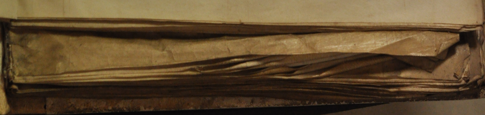

# Disseminating Alexander’s Works

Alexander was no a stranger to the publishing process when he came to Cirencester. It has already been shown that while Hunt attributed the majority of Alexander's works to his time at Cirencester [@hunt:1984schools, chap. 2], this is largely founded on a dichotomy between 'scholastic' and 'monastic' writings, with the assumption that the latter could only have been produced at Cirencester. The result unrealistically places the publication of only seven works before his move to Cirencester by 1205, and at least fourteen (including his most complex and lengthy writings) to the final period of his life, when he would also have been most consumed with administrative duties. Given the likelihood that Alexander became an Augustinian at Oxford, it stands to reason that at least some of his works could also have been published there, but it is difficult to know which ones. One manuscript that can plausibly be attributed to his time at St Frideswide's is the first booklet of Oxford, Jesus College, 94, which contains his gloss on the Psalter. The last two booklets were produced at Cirencester, and contain his unfinished commentary on Proverbs and his *Tractatus super Mulierem fortem*. These provide insight into his working methods, showing that he continued to edit his works after they were first published, like many of his contemporaries, with copies representing the unrevised text continuing to circulate. They also hint at a concerted effort to disseminate his works after their completion. He was assisted by his fellow canon Walter de Melida, named variously as a *socius*, *capellanus*, or *clericus* in the Cirencester cartulary. Two surviving letters document Walter's enduring concern to catalogue and distribute Alexander's works after the abbot's death, building relationships with other nearby religious communities.

## The importance of institutional context to twelfth-century writers

Scholars are often unwilling to speak of 'publication' in a medieval context, with the specific modern connotation of printing a work [cf. @simpson:1989oxford, s.v. 'publish, *v.*' 3]. It might be more accurate to suggest that the process of printing, rather than being a prerequisite for true publication, merely gave a more definitive structure to its commercialization. Medieval authors conducted similar activities of editing and revision to their modern counterparts, and 'published' their work in the literal sense of the word's origin in *publicare*, to make public. Richard Sharpe, examining the work of Anselm of Canterbury, has shown that the medieval equivalent to what is today called publication is better found in the term *edere*, 'to bring forth' [@sharpe:2009anselm, p. 1n2]. Research on other authors of the twelfth and thirteenth centuries has shown the extent to which their work cannot be understood outside their institutional context. Authors' success was dependent not only on the excellence of their work, but on the availability of a community that would aid in the production and promotion of writing both during their lifetime and after their death.

Hugh of St Victor, who so deeply influenced Alexander Neckam, is one of the most prominent examples of the prominent role an Augustinian house could take in setting the course of an author's writings [recent scholarship on this is summarized by @berndt:2011writings]. After Hugh's death in 1141, an edition of his complete works was created at the order of his abbot, Gilduin. This effort involved both cataloguing Hugh's known works and organizing them into four thematic volumes, allowing easy reference and copying. The existence of this effort and its results was discovered only though a document entitled *Indiculum* that lists the contents of these original four volumes, which survives by chance in a fifteenth-century copy, Oxford, Merton College, MS 49 [first published in @deghellinck:1910table]. It stands to reason that many other such efforts could be found with more careful examination of the evidence. None of the original manuscripts survive, though a direct and contemporary copy from St Victor survives in Paris, Bibliothèque Mazarine, MS 711, produced between 1141 and 1150 [see especially @stammberger:2005edition; @poirel:2002livre, pp. 27–86; Hugh's *De quinque septenis* is edited from this manuscript in @dunning:2016hugh]. It has become increasingly apparent that this edition was enormously influential in establishing the form and contents of Hugh's corpus, and in promoting its dissemination. It is also a useful basis for understanding Hugh's thought within his historical context. Paul Rorem has written a successful introduction to Hugh by working through his major works in the order they appear in the *Indiculum* [@rorem:2009hugh, pp. 13–14]. An effort is now underway to recreate the text of this edition [@berndt:2008hugonis, p. 15; Hugh's *De quinque septenis* is edited in @dunning:2016hugh]. Hugh was also fortunate to have been associated with a well-endowed house that had the resources to continue promoting his work into the modern period, with editions of his *opera omnia*, as well as those of Richard of St Victor, serving in part as a means to promote the house and coalesce its identity [@quantin:2010réception].

Institutional support can, indeed, be found behind almost every medieval author whose works became widely known and survived into the present. William of Malmesbury worked with at least four other assistants in acquiring books and making copies of his own [@thomson:2003william, p. 77]. Peter of Blois benefited from his position in government in fostering the dissemination of his letters [@southern:2004blois]. Even the works of a minor author such as Samuel Presbiter survived because his connection to Bury St Edmunds allowed him to assemble his works into two matching edited volumes, later preserved in the abbey library [@dunning:2015samuel, pp. 5–7<!-- check -->]. No medieval writer worked alone.

Alexander's work with other scribes is most obviously demonstrated by the interest his works reflect in the mechanics of publishing. His remarks in *De nominibus utensilium* and *Sacerdos ad altare*, both works designed for teaching Latin, indicate a personal interest in the practicalities of writing. The former treatise is detailed enough that a scribe's writing desk has been reconstructed primarily based on its description [@vezin:2005reconstitution; for other codicological uses of Alexander's descriptions, see @gasparri:2007terminologie; @copeland:2010naming]. These works also provide some of the best descriptions of tacketed binding [@gullick:1996scribe, p. 240; cited in @gumbert:2011tacketed, p. 303n12, who suggests an emendation to the text, discussed at 318–20]. Contemporary manuscripts surviving from Oxford and Cirencester, some of which include annotations from Alexander himself, give us a glimpse into Alexander's own working methods, and into the process of disseminating his works during his life and in the decades following his death.

## Additions to Oxford and Cirencester manuscripts

One of the most exciting aspects of studying medieval texts is the possibility of reading the same volumes that authors themselves worked on. Medieval autographs are constantly being discovered; we famously have writings in the hand of Thomas Aquinas and Albert the Great [the classic article on medieval autographs is @lehmann:1920autographe; updated, @lehmann:1941autographe]. Less studied, but probably even more common, is the situation of a book not copied but corrected by its author. This can be difficult to detect, and the identification is often debatable.

There are a number of authors from twelfth- and thirteenth-century England whose works have been found in autograph. The flexible nature of historical writing lends itself particularly well to discovering authorial modifications, and some of the most interesting examples from this period include William of Malmesbury [@ker:1944william], Matthew Paris [@vaughan:1953handwriting; @vaughan:1958matthew], and Ranulph Higden [@galbraith:1959autograph]. Universal to these are the substantive revisions one would immediately associate with revised manuscripts: typically not only consisting of revisions but of erasure and modification of existing material. Matthew Paris, for instance, adds to the margin of his *Gesta abbatum* an anecdote explaining Alexander Neckam's unusual name. He presumably learned of it after the passage was originally composed, and added it at an appropriate point in the chronology. Studies have also consistently noted the presence of tinkering with more detailed aspects of the work: changes to paragraph structure, chapter divisions (Ranulph Higden being an especially amusing example of this, who contrives new openings for many chapters of his *Polychronicon* to make their first letters spell his name), spelling, and especially punctuation. These details often do not come out in editions of these works, because modern editors usually modernize all punctuation and almost always omit it from their critical apparatus.

### Oxford, Jesus College, 94

Alexander's hand was first identified by @hunt:1984schools [pp. 30–31]. He guessed that part of Oxford, Jesus College 94 containing a revised version of the gloss on the Psalms preserves the author's handwriting, but did not explain his rationale in detail. Further enquiry shows that Hunt was right, but also shows that Alexander revised the entire manuscript, and reveals him at work in several other Cirencester books. The greater problem with the manuscript is whether the gloss on the Psalms was produced at Oxford or Cirencester, and who assembled it into its present state.

Jesus College 94 once belonged to Cirencester, and consists of three separate booklets. The volume is collated i, 1^8^, 2^10^–4^10^ (the last of these gatherings marked ·iiii·), 5^10^ (·ix·), 6^8^ (·x·) || 7^8^, 8^8^, 9^8-1^ (8 cancelled) || 10^8^–14^8^, 15^6^, 16^4^, for a total of 129 parchment leaves. The gloss on the Psalms is contained in the first booklet: that these first six gatherings once represented a separate manuscript is obvious from their smaller size (273 × 331 mm) in comparison to the other sections.

#### Gloss on the Psalms

In Alexander's commentary on the Psalms, we find a series of notes that certainly appear to be additions; it is also worth noting that the manuscript is a rather rough-looking copy, which seems to be common to other extensively annotated working copies. Before assuming they are from the author, however, it is necessary to determine that they are not either mere omissions or passages copied from another manuscript representing a revised version of the work. If one compares the manuscript to other surviving copies of the commentary, one finds in fact that none of them contain the additions – except one, now London, British Library, Royal MS 2.C.XI. If one compares the texts closely, however, the only logical conclusion is to say that could not have been copied from the Royal manuscript into Jesus College 94, and that the reverse is likely true. The Royal manuscript contains all the additions, but they are sometimes integrated in a slightly different way from that indicated in the annotated copy, and often a few words have been added to make the transitions smoother [to be fair, @hunt:1936alexander, pp. 266–271, includes an extract from the commentary to Psalm 5, indicating that he was probably aware of this]. Besides tidying various things up, the additions are largely adding to the authorities cited, noting for example relevant examples from the *Glosa*. It is not altogether clear what period the manuscript is from: it certainly does not have the appearance of other books produced at Cirencester. On the other hand, the lack of the additions in most of the manuscripts shows that the text had circulated before the revisions were made, so they are probably to be tied to intellectual development at Cirencester. The manuscript is incomplete, and was combined with two other booklets to form a volume of Alexander's works. The Cirencester community did not apparently think it particularly usable, for they later acquired an enormous deluxe copy, complete with illustrations in gold leaf – lacking, however, the revisions.

His gloss on the Psalms is directly linked to his teaching work, and Hunt notes a reference to the Third Crusade in the work, meaning that it must have been completed after 1193; but his conclusion that it was finished at Cirencester is based on the incorrect assumption that Alexander had not already become an Augustinian at Oxford [@hunt:1984schools, pp. 26-27].

#### Commentary on Proverbs

Alexander can be more certainly be found revising the other parts of Jesus College 94, which were once separate manuscripts: an unfinished commentary on Proverbs, and the *Tractatus super Mulierem fortem*, a meditation on the last chapter of Proverbs. These are both much cleaner copies than the Psalms commentary, and it seems Alexander wished to keep them that way: most of his additions have been written faintly somewhere in the margin (often at the base of the page), and later another scribe has integrated them more formally into the text. Where an addition is too long to be inserted directly, the addition is generally recopied and has a decorative border applied to it. Long additions to these texts are fairly scarce, but again the purpose of many of them seems to be to integrate additional quotations, as for example when a line from Job 29:18 is added to an already long collection of Old Testament references in the proem to Proverbs (fol. 57va). There are also many corrections of spelling that do not change the meaning of the text.

#### *Tractatus super Mulierem fortem*

There are no other copies of the commentary on Proverbs to which the text can be compared; in the case of *Super Mulierem fortem*, however, one finds the interesting phenomenon that the other copy of the text (Oxford, Bodleian Library, MS Bodley 528) does not include the corrections, and where one can make out the pre-corrected reading in the Jesus College manuscript, it usually matches that of the Bodley text. Evidently, then, this is a case of later revision to the text rather than an exemplar being corrected before the text is copied for distribution elsewhere. In this text, the most significant additions are marginal headings added to the latter parts of the work, imitating the style found in Alexander's larger commentaries. One also finds, again, seemingly unnecessary changes to spelling, and it is also possible to perceive changes to punctuation and paragraph structure. Headings are also a primary focus of his attention in correcting the copy of *De naturis rerum* (a hybrid discussion of natural phenomena and commentary on Ecclesiastes) now Oxford, Magdalen College, MS 139. From this revision stems two different textual traditions: one including numbered chapters with headings in the later books, and one lacking these.

'no relationship may be established between the MSS. that would suggest one as the possible source of the other.' [@mahoney:1971critical, p. vii]

'there would appear to be no direct relationship between the MSS, thst would make one the probable source of the other. There are few substantive difierences between the MSS., and the MSS. appear free from major corruption.' [@mahoney:1971critical, p. xi]

### Other Manuscripts

@gullick:1990twelfthcentury [pp. 21–23] discovered a second manuscript containing the same hand as that identified by Hunt: here, Alexander can be found intelligently correcting and annotating a copy of the letters of Thomas Becket (London, British Library, Cotton MS Claudius B.ii). Gullick notes Alexander's habit of arranging marginal notes in the form of a reversed triangle – a form repeated even in the marginal notes of copies of Alexander's works. Cirencester manuscripts also demonstrate a slightly unusual form of punctuation [@ker:1960english, p. 48 and pl. 20b]. There are a number of other books that have corrections looking like Alexander's hand, but it seems that there was at least one other person at Cirencester who wrote similarly.

Compare another manuscript which it is tempting to think might have been corrected by Alexander: London, British Library, Royal MS 7.F.I. This is the sole witness to *Speculum speculationum*, a theological *summa* following the structure of Peter Lombard's *Sentences*. Here, like the manuscripts of the commentary on Proverbs, *Tractatus super Mulierem fortem*, and *De naturis rerum*, we have a number of marginal corrections in a hand similar to that identified as Alexander's, but which seems to differ somewhat [as judged in @thomson:1988alexander, p. xx]. Almost all the examples appear to be corrections from an exemplar, since they can be seen to be cases of *homoeoteleuton*.

- *De naturis rerum*

## The work of Walter de Melida as Alexander's literary executor

Alexander may have had a literary executor of sorts in Walter de Melida (alternatively Melide or Melidie; this spelling chosen on the basis of his autograph in a Canterbury manuscript).<!-- BL spelling? --> A document dated June 1200–July 1205 found in the Cirencester cartulary first refers to him by his full name and later as 'magistro Waltero'. This appoints him assistant to Alan the cellarer: these two are also responsible for reporting to the bishop of Worcester and the archdeacon of Gloucester anything the abbot of Cirencester might do that contravenes the arrangement made by this charter [@ross:1964cartulary, pp. 1:295–296 (no. 327/186): 'fratrem uero Walterum de Melide constituit socium Alani celarii jta tamen quod predictus Alanus precipuam et plenam habeat amministracionem tam jnfra cepta curie quam extra super omnibus que ad officium celarii pertinent'; discussed in @ross:1964cartulary, 1:xx]. The same document confirms that he is not to be identified with Walter of Gloucester, later abbot from 1217–30. A 'Waltero capellano' or 'magistro W. capellano' acting in an administrative capacity also appears in four documents from 1203, 1208, and 1218–36 [@ross:1964cartulary, pp. 2:502 (no. 582), 2:525 (no. 613), 2:340–42 (nos. 378/404, 379/403)], and there is a reference in an undated thirteenth-century document to a 'terram Walteri capellani' [@ross:1964cartulary, p. 3:983 (no. 627)]. It is probably the same Walter who was paid for taking a message from the king to Alexander, where he is referred to specifically as clerk of Alexander ('Waltero Clerico suo' and 'Waltero Clerico Magistri Alexandri Nequam eunti in nuncium domini sui') [@cole:1844documents, p. 242 (*Rotulus misae*, 14 John); cited in @hunt:1984schools, p. 13]. He might also be identifiable with the 'W. clerico' who witnesses a charter for Alexander between 1213–17, though this figure is not necessarily a canon of Cirencester [@ross:1964cartulary, pp. 2:413–414 (no. 465)]. He must, therefore, have been active at Cirencester before 1200–1205 (since he had already gained a position of trust by that time), and lived at least until 1218.

Walter's name likely refers to Mileto, Calabria, which is called Melide in the chronicle of Roger of Hoveden. He notes that Richard I stayed at the town's abbey of the Holy Trinity on 21 September 1190 [@stubbs:1868chronica, p. 3:45; @riley:1853annals, p. 2:157]. This abbey was established by Roger I, the Norman count of Sicily [@occhiato:1978labbatiale; @loud:2007latin, pp. 88–89]. One might speculate that Walter, perhaps a Norman from Roger's Augustinian foundations at Bagnara, through which Richard would likely have passed, joined the party on its return to England. One can also find a Peter de Melide a few decades earlier [@bigelow:1879placita, pp. 312–313].

*socius*. Reginald of Priverno similarly held the position of *socius continuus* with Thomas Aquinas; he acted as a combination secretary and companion [@spiazzi:1995san, pp. 109-110].sa

### Walter de Melida and Roger Noreys

The most vivid evidence for Walter's work comes in the form of correspondence with two Benedictines. One appears in Canterbury, Cathedral Library, MS Lit. B.13, which includes a number of sermons written by Alexander; it was owned by Roger Noreys, a monk at Christ Church, Canterbury in the early thirteenth century [@greatrex:1997biographical, p. 244 identifies him with the controversial abbot of Evesham, but this is unlikely; see @sayers:2004norreis]. He gave a number of books to its library, the number of which is somewhat ambiguous in the catalogue: it might be either eleven or sixty-four, depending on how it is read. These included a copy of Alexander's *De naturis rerum* [@james:1903ancient, p. 102 (no. 1106)]. It originally lacked the end of Alexander's sermon 39 [for a listing of Alexander's sermons, see @hunt:1984schools, pp. 000–000]. Roger seems to have asked about this on a trip to Cirencester. Walter supplies the requested end of the sermon, asking in return for a list of the available sermons by Alexander, as quickly as possible:

> Dilecto sibi in cristo et amico karissimo R. capellano arch*iepiscopi*. suus W. de Melida. Salutem et se ipsum. Mitto uobis finem sermonis illius qui sic incipit. Tu exurgens misereberis syon. [Ps. 101:14] Rogo etiam uos quatinus notetis in quadam cedula omnium sermonum principia quos habetis penes uos et mittatis michi per primum nuntium quem inuenire poteritis. Inueni enim postquam recessistis a me sicut uoluntas dei fuit quosdam sermones magistri Alex' [*erasure of twelve words*] ubi continentur alii eius sermones quos penes uos non habetis. et quia memoriter non retineo omnes quos penes uos habetis omnium principia michi mittite. ut sic sermones illos quos non habetis scribere faciam. Valete. [Canterbury, Cathedral Library, MS Lit. B.13, fol. 67r: quoted in @ker:1969medieval, p. 2:274]<!-- check in MS -->

> W. de Melida, to his beloved in Christ and friend, the most dear R., chaplain to the archbishop, greetings and himself. I am sending you the end of the sermon beginning, *Thou shalt arise, and have mercy upon Sion.* [Ps. 102:13] I also ask you to mark on some sheet the beginnings of all the sermons that you have in your possession and send them to me by the first messenger<!-- better trans? 'embassy'? --> you can find. For I found after you left me, as if it happened by the will of God, some sermons of master Alexander where other of his sermons are contained which you do not have in your possession, and because I do not accurately remember all those which you already have, send me the beginnings of them all, that I may thus have written those sermons which you do not have. Farewell.

Walter is evidently quite eager to spread Alexander's writings, and probably to collect them himself as well. He might have had a book similar to Oxford, Bodleian Library, MS Wood empt. 13 (*SC* 8601), which is a collection of most, but not all, of Alexander's sermons (lacking, for example, a few found in the Canterbury manuscript). Such activity could have responsible for the sermons attributed to Alexander (as abbot of Cirencester) copied into Oxford, Jesus College, MS 94, fols 74v–77v, one of which is by Peter Comestor, while the other R.W. Hunt did not believe to be genuine [@hunt:1984schools, pp. 22–23, 150].

### Editing Alexander's sermons: Oxford, Bodleian Library, Wood empt. 13

### Walter's correspondance with Malmesbury on *Corrogationes Promethei*

The second letter is from S., prior of Malmesbury, writing to Walter on his admiration of Alexander's work, and focusing particularly on the *Corrogationes Promethei*: he does not refer to the book by this title, but describes it as being about the meanings of words, designed as an introductory work for the instruction of boys, and having a prologue, which leaves no other options. It occurs at the end of the verse anthology in Paris, Bibliothèque nationale, MS lat. 11867, fol. 240va–b, and in a copy of *Corrogationes Promethei* from Sempringham Priory, now London, British Library, Royal 5 C V, fol. 57rb–vb [an earlier part of the letter is quoted from the Paris manuscript in @meyer:1896notice, p. 657n1; summarized in @hunt:1984schools, p. 12]. He refers to Alexander in glowing terms: 'Non enim solummodo aurum recipit⸵ sed et auro tota uestitur' ('For he has not only accepted gold, but is entirely clothed in it'). The prior eludes further identification, though he is also noted in a document from 1246 [@jones:1891charters, p. 301; cited in @russell:1932alexander, p. 265n8]. (It is interesting that several additions to the Alexander Neckam florilegium in Cambridge, University Library, Gg.6.42, potentially added by monks at Malmesbury, are drawn from the *Corrogationes Promethei*.) It is hard to guess what might have prompted this letter: after a long and rhetorical effusion in Alexander's praise, there is a puzzling conclusion:

> Hec mea sententia […].<!-- Find out what is in BL: P illeg. --> Vos uideritis utrum bene et plene. Mea michi mens fideli testimonio suggerit⸵ non extasse in uerbo. Vtinam hec uobis placeant. sin autem. michi primum notificate quid displiceat. Valete karissime.

> These are my thoughts […]. You will have seen whether they are agreeable and clear. My mind suggests to me in faithful testimony not to write too much. I hope these are pleasing to you; if they are not, let me know first what displeases.^[Paris, BnF, MS lat. 11867, fol. 240vb]

S. does not seem concerned that what he is writing will be in any way controversial, but whether it will suit a particular purpose Walter has in mind. The terms in which he speaks of Alexander suggest that he is writing after the abbot's death; did Walter request an encomium from Malmesbury? If so, what purpose would have allowed enough time for S. to leave open the possibility for revision if the letter was not precisely what Walter needed?

More potential evidence for a literary executor conducting a concerted campaign to spread Alexander's works appears in the consistency and dating of surviving manuscripts. Most copies of *De naturis rerum*, *De nominibus utensilium*, and *Corrogationes Promethei* all have a remarkably consistent appearance, and largely date from the same period. This is apparent enough that it was noted even by Thomas Wright, who observed that there was a pattern of consistent marginal titles in his manuscripts of *De naturis rerum*, suggesting that they were part of the original [@wright:1863alexandri, p. lxxvii]. <!-- (Faith Wallis has mused that this might have been some sort of campaign for distributing the material.) -->

<!--- page layout + Cirencester? -->

## Results of the dissemination effort

- where did everything end up?

- how does this compare to contemporary authors: W. de Montibus, Peter the Chanter?

Just as

The manuscripts discussed here of Alexander Neckam are not autographs in the usual sense, but contain revisions that can be demonstrated to represent a later form of a text; original modifications as opposed to those that might have been made from the exemplar; and multiple changes to minute details such as punctuation and spelling. While some of these features could be the work of readers, the ability to link them to more substantive revisions seems sufficient to confirm an authorial presence. These trends should cause us to think about the way we edit medieval books. If authors thought it worth their time to correct their punctuation, surely it is worth our time to track this and present these details to modern readers. With the ability to present an edition of a text in a digital format, this can be done easily without sacrificing readability. It is not always clear *why* these particular books were produced. They are not presentation copies, nor do they always seem to have served as exemplars; where copies are known to have been made at all, the corrections are often not present in other manuscripts. They seem to have been personal copies that existed primarily for the pleasure of a local community, as a benefit of having a resident author.
