# Disseminating Alexander’s Works

Alexander was no a stranger to the publishing process when he came to Cirencester. It has already been shown that while Hunt attributed the majority of Alexander's works to his time at Cirencester [@hunt:1984schools, chap. 2], this is largely founded on a dichotomy between 'scholastic' and 'monastic' writings, with the assumption that the latter could only have been produced at Cirencester. The result unrealistically places the publication of only seven works before his move to Cirencester by 1205, and at least fourteen (including his most complex and lengthy writings) to the final period of his life, when he would also have been most consumed with administrative duties. Given the likelihood that Alexander became an Augustinian at Oxford, it stands to reason that at least some of his works could also have been published there, but it is difficult to know which ones. One manuscript that can plausibly be attributed to his time at St Frideswide's is the first booklet of Oxford, Jesus College, 94, which contains his gloss on the Psalter. The last two booklets were produced at Cirencester, and contain his unfinished commentary on Proverbs and his *Tractatus super Mulierem fortem*. These provide insight into his working methods, showing that he continued to edit his works after they were first published, like many of his contemporaries, with copies representing the unrevised text continuing to circulate. They also hint at a concerted effort to disseminate his works after their completion. He was assisted by his fellow canon Walter de Melida, named variously as a *socius*, *capellanus*, or *clericus* in the Cirencester cartulary. Two surviving letters document Walter's enduring concern to catalogue and distribute Alexander's works after the abbot's death, building relationships with other nearby religious communities.

## The importance of institutional context to twelfth-century writers

Scholars are often unwilling to speak of 'publication' in a medieval context, with the specific modern connotation of printing a work [cf. @simpson:1989oxford, s.v. 'publish, *v.*' 3]. It might be more accurate to suggest that the process of printing, rather than being a prerequisite for true publication, merely gave a more definitive structure to its commercialization. Medieval authors conducted similar activities of editing and revision to their modern counterparts, and 'published' their work in the literal sense of the word's origin in *publicare*, to make public. Richard Sharpe, examining the work of Anselm of Canterbury, has shown that the medieval equivalent to what is today called publication is better found in the term *edere*, 'to bring forth' [@sharpe:2009anselm, p. 1n2]. Research on other authors of the twelfth and thirteenth centuries has shown the extent to which their work cannot be understood outside their institutional context. Authors' success was dependent not only on the excellence of their work, but on the availability of a community that would aid in the production and promotion of writing both during their lifetime and after their death.

Hugh of St Victor, who so deeply influenced Alexander Neckam, is one of the most prominent examples of the prominent role an Augustinian house could take in setting the course of an author's writings [recent scholarship on this is summarized by @berndt:2011writings]. After Hugh's death in 1141, an edition of his complete works was created at the order of his abbot, Gilduin. This effort involved both cataloguing Hugh's known works and organizing them into four thematic volumes, allowing easy reference and copying. The existence of this effort and its results was discovered only though a document entitled *Indiculum* that lists the contents of these original four volumes, which survives by chance in a fifteenth-century copy, Oxford, Merton College, MS 49 [first published in @deghellinck:1910table]. It stands to reason that many other such efforts could be found with more careful examination of the evidence. None of the original manuscripts survive, though a direct and contemporary copy from St Victor survives in Paris, Bibliothèque Mazarine, MS 711, produced between 1141 and 1150 [see especially @stammberger:2005edition; @poirel:2002livre, pp. 27–86; Hugh's *De quinque septenis* is edited from this manuscript in @dunning:2016hugh]. It has become increasingly apparent that this edition was enormously influential in establishing the form and contents of Hugh's corpus, and in promoting its dissemination. It is also a useful basis for understanding Hugh's thought within his historical context. Paul Rorem has written a successful introduction to Hugh by working through his major works in the order they appear in the *Indiculum* [@rorem:2009hugh, pp. 13–14]. An effort is now underway to recreate the text of this edition [@berndt:2008hugonis, p. 15]. Hugh was also fortunate to have been associated with a well-endowed house that had the resources to continue promoting his work into the modern period, with editions of his *opera omnia*, as well as those of Richard of St Victor, serving in part as a means to promote the house and coalesce its identity [@quantin:2010réception].

Institutional support can, indeed, be found behind almost every medieval author whose works became widely known and survived into the present. William of Malmesbury worked with at least four other assistants in acquiring books and making copies of his own [@thomson:2003william, p. 77]. Peter of Blois benefited from his position in government in fostering the dissemination of his letters [@southern:2004blois]. Even the works of a minor author such as Samuel Presbiter survived because his connection to Bury St Edmunds allowed him to assemble his works into two matching edited volumes, later preserved in the abbey library [@dunning:2015samuel, pp. 5–7<!-- check -->]. No medieval writer worked alone.

Alexander's work with other scribes is most obviously demonstrated by the interest his works reflect in the mechanics of publishing. His remarks in *De nominibus utensilium* and *Sacerdos ad altare*, both works designed for teaching Latin, indicate a personal interest in the practicalities of writing. The former treatise is detailed enough that a scribe's writing desk has been reconstructed primarily based on its description [@vezin:2005reconstitution; for other codicological uses of Alexander's descriptions, see @gasparri:2007terminologie; @copeland:2010naming]. These works also provide some of the best descriptions of tacketed binding [@gullick:1996scribe, p. 240; cited in @gumbert:2011tacketed, p. 303n12, who suggests an emendation to the text, discussed at 318–20]. Contemporary manuscripts surviving from Oxford and Cirencester, some of which include annotations from Alexander himself, give us a glimpse into Alexander's own working methods, and into the process of disseminating his works during his life and in the decades following his death.

## Additions to Oxford and Cirencester manuscripts

One of the most exciting aspects of studying medieval texts is the possibility of reading the same volumes that authors themselves worked on. Medieval autographs are constantly being discovered; we famously have writings in the hand of Thomas Aquinas and Albert the Great [the classic article on medieval autographs is @lehmann:1920autographe; updated, @lehmann:1941autographe]. Less studied, but probably even more common, is the situation of a book not copied but corrected by its author. This can be difficult to detect, and the identification is often debatable.

There are a number of authors from twelfth- and thirteenth-century England whose works have been found in autograph. The flexible nature of historical writing lends itself particularly well to discovering authorial modifications, and some of the most interesting examples from this period include William of Malmesbury [@ker:1944william], Matthew Paris [@vaughan:1953handwriting; @vaughan:1958matthew], and Ranulph Higden [@galbraith:1959autograph]. Universal to these are the substantive revisions one would immediately associate with revised manuscripts: typically not only consisting of revisions but of erasure and modification of existing material. Matthew Paris, for instance, adds to the margin of his *Gesta abbatum* an anecdote explaining Alexander Neckam's unusual name. He presumably learned of it after the passage was originally composed, and added it at an appropriate point in the chronology. Studies have also consistently noted the presence of tinkering with more detailed aspects of the work: changes to paragraph structure, chapter divisions (Ranulph Higden being an especially amusing example of this, who contrives new openings for many chapters of his *Polychronicon* to make their first letters spell his name), spelling, and especially punctuation. These details often do not come out in editions of these works, because modern editors usually modernize all punctuation and almost always omit it from their critical apparatus.

### Oxford, Jesus College, 94

Alexander's hand was first identified by @hunt:1984schools [pp. 30–31], who proposed that Oxford, Jesus College 94 preserves the author's handwriting. There are two major problems with the manuscript: the origin of the gloss on the Psalter, and the identity of a hand that is similar to Alexander's but differs markedly. This can be identified with Walter de Melida, Alexander's clerk, who probably assembled the volume in its final state.

Jesus College 94 once belonged to Cirencester, and consists of three separate booklets. The volume is collated i, 1^8^, 2^10^–4^10^ (the last of these gatherings marked ·iiii·), 5^10^ (·ix·), 6^8^ (·x·) || 7^8^, 8^8^, 9^8-1^ (8 cancelled) || 10^8^–14^8^, 15^6^, 16^4^, for a total of 129 parchment leaves. These contain, respectively, Alexander's gloss on the Psalter; his unfinished commentary on Proverbs, to which have been added two spurious sermons; and his *Tractatus super Mulierem fortem*.

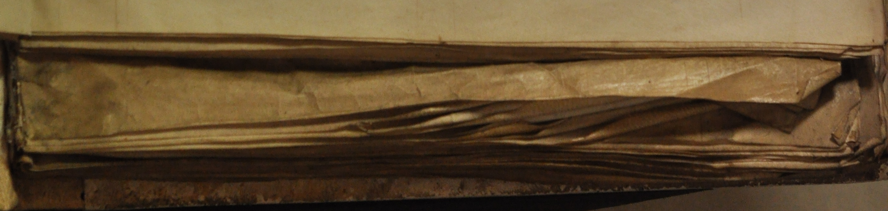

#### Gloss on the Psalter

It is immediately apparent from the smaller size of this section (273 × 331 mm) in comparison to the rest of the manuscript that this has a different context from the other booklets. It is heavily worn, and represents the remnants of a much more extensive manuscript. Its text is incomplete due to lost gatherings, as can be seen from the manuscript's collation. Alexander's gloss on the Psalter is directly linked to his teaching work, representing his lectures on this text. Hunt notes a reference to the Third Crusade in the work, meaning that it must have been completed after 1193; he also notes that it must have been written after he joined the Augustinians [@hunt:1984schools, pp. 26-27]. He assumes this means that it must have been completed at Cirencester, probably influenced by the prominent *ex libris* mark.[^exlib] This is followed by a further rubric, 'Glose magistri Alexandri abbatis cyrenc' super psalterium.' Both of these are later additions to the manuscript: the *ex libris* is written in a fourteenth-century cursive, and the rubric was not intended as part of the original page design, written above the text block in a different shade of red from that used to highlight the letters of the first line. This can only be used to demonstrate that the book was owned by Cirencester in the thirteenth century. The style of the rest of the booklet is entirely unlike other manuscripts produced at Cirencester.

[^exlib]: Oxford, Jesus College 94, fol. 1r:

    > Liber sancte Marie Cyrencestr' in quo continentur glose super psalterium quam composuit Magister Alexander \
    > Item tractatus super principium parabolarum et finem Item tractatus super Mulierem fortem

This booklet is instead the only known manuscript whose production can plausibly be attributed to St Frideswide's. The text is far more extensively revised than any other work by Alexander, vastly increasing the number of references to the biblical *Glosa* and other commentators and even adding new lemmata. The other works in Jesus College 94 only make relatively minor improvements to the text, with occasional additions of new biblical quotations. Alexander would have had far more reason to have made these changes while he was lecturing on the text; it is most plausible that this represents the working copy from his lectures.

The case that the additions to the manuscript belong to Alexander is strengthened by their integration into London, British Library, Royal MS 2 C.XI. The Royal manuscript also makes additional adjustments to the text, adopting the additions but also tidying them slightly [cf. @hunt:1936alexander, pp. 266–271, an extract from the commentary to Psalm 4]. The nature of these additions indicates that Jesus College 94 could not have been copied from the Royal manuscript. London, Lambeth Palace, 61, represents the uncorrected state of the text. Oxford, Bodleian Library, Bodley 284 (*SC* 2339: from Cirencester) also appears to follow this first recension, at least in places, but Hunt believed that it followed the second; a full collation is necessary to verify this. While Hunt is hesitant to make a definitive judgement on the identity of the scribal additions to the gloss, there seems to be no other plausible explanation, especially with the additional evidence provided by @gullick:1990twelfthcentury [pp. 21–23].

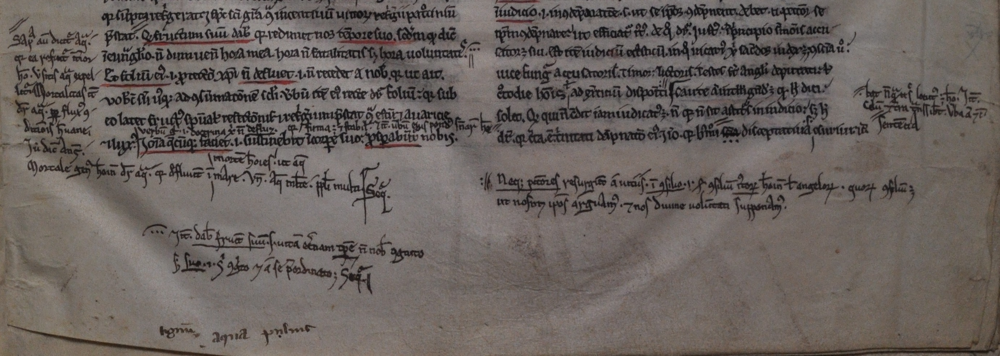

If the theory is correct that Alexander first wrote his gloss in his earlier days as a lecturer at Oxford, and revised it as he worked, this would also show that he had the means to publish copies from St Frideswide's. One also finds an alternate recension of Alexander's commentary on the Athanasian Creed in Oxford, Bodleian Library, Rawl. C.67 (*SC* 15517), which Hunt had attributed to the earlier part of Alexander's career [@hunt:1984schools, pp. 129–130]. Here, the changes are much less extensive than in the gloss on the Psalter. The only other known book produced at St Frideswide's in this period is now [Paris, Bibliothèque nationale, fr. 24766](http://gallica.bnf.fr/ark:/12148/btv1b8452207n/f313.item); a note at the end of the text indicates that it was completed either the day before or in the early hours of St Andrew's Day, 30 November 1212.[^andrew] The implication is that brother A. was working alone. It is dangerous to work from silence, but given the sheer lack of manuscripts from St Frideswide's, and the relatively unfinished state of production that the Jesus College Psalter booklet can be found in, one wonders whether the same was true for Alexander, with him either copying out his own work or hiring another scribe on an individual basis. The Lambeth copy of the first recension might have originated with a student, as was the case for many such works. If by moving to Cirencester Alexander gained access to its highly trained scribes, this would have provided a publication organ much better suited to his work than he had at Oxford.

[^andrew]: Paris, Bibliothèque nationale, fr. 24766, fol. 151r:

    > Explicit opus manuum mearum quod compleui. Ego frater A. subdiaconus.<!-- check whether there are any candidates in cartulary --> Sancte Frideswide seruientium minimus. Anno uerbi incarnati. .mº.ccº.xiiº. Mense .xiº. Ebdomada .iiiiª. feria .vi. In vigilia sancti Andree Apostoli. Anno conuersionis mee .viiº. Ad laudem et honorem domini nostro iesu cristi Qui cum patre et spiritu sanct viuit et Regnat deus per infinita secula seculorum. Amen.

One could therefore construct the following narrative for this booklet: Alexander's copy of his gloss on the Psalter was first produced at Oxford after 1193, after which some copies were made from the manuscript. He revised the text as he continued to teach as a canon at St Frideswide's, and brought the copy (probably becoming somewhat bedraggled with use) with him to Cirencester. More copies were made at some point that included his changes in the text, with either himself or another cleric revising the text mildly to integrate the additions more thoroughly. After Alexander's death, the booklet was included in this manuscript to assemble his lesser or unfinished biblical commentaries, omitting booklets that had been lost or damaged; Bodley 284 might have been commissioned as a replacement.

#### Commentary on Proverbs

Alexander's commentary on Proverbs, entitled *Tractatus super Parabolas Salomonis*, forms most of the second booklet of Jesus College 94. This copy is unfinished, and it is unlikely that it ever reached a more advanced state. He only claims to have begun the work in *Speculum speculationum*: 'Memini autem me aliqua proposuisse super hoc in ingressu tractatus quem institui super parabolas.' [@thomson:2011alexandri, 3.81.1: London, British Library, Royal 7 F.1, fol. 68va] This did not stop copies from being made: one was owned by the Carmelite Hulne Priory [@humphreys:1990friars, F15.1], and another by the Dominicans at Lincoln [according to Leland's notes in London, BL, Royal App. 69, fol. 3r: cited in @hunt:1984schools, p. 137]. The only known excerpts from the work, found in *Sol meldunensis* [Oxford, Bodleian Library, Hatton 102 (*SC* 4051), fol. 200v, cited in @hunt:1984schools, p. 136, includes two passages that are cited from the commentary on Proverbs, but are from the *Tractatus super Mulierem fortem*].

Alexander revises the text as he works: the same hand from the gloss on the Psalter can be found making many additions in both this booklet and the *Tractatus super Mulierem fortem*. While the additions to the gloss focus on revising the content, Alexander is far more interested in these booklets in smaller details, even changing the scribes' spelling usage and changing the punctuation. In the Proverbs commentary, there are only a handful of lengthy additions. These are roughed in by Alexander in the margin: in ink on the first few folios, and later in plummet, recopied by a professional scribe with the addition of a decorative frame. As with the gloss on the Psalter, the purpose of the longer additions is typically to integrate additional quotations, as when a line from Job 29:18 is added to an already long collection of Old Testament references in the proem to Proverbs (fol. 57va). There are also many corrections of spelling that do not change the meaning of the text. Some of the corrections are made in a hand similar to Alexander's, but not the same: most notably, Alexander's 'g' has a straight descender, whereas the alternate hand hooks the descender into the body of the letter. This belongs to Walter de Melida, Alexander's clerk, as is discussed below.

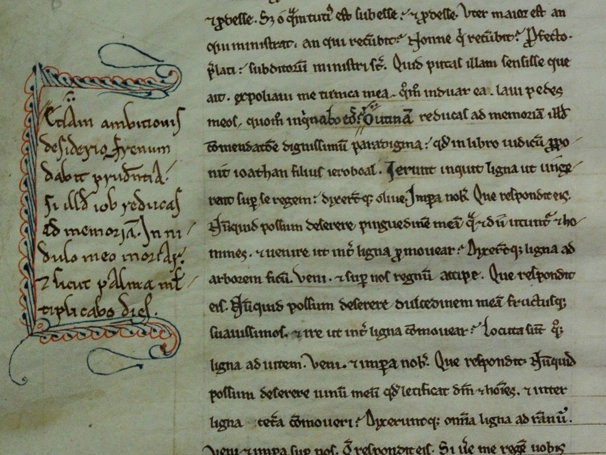

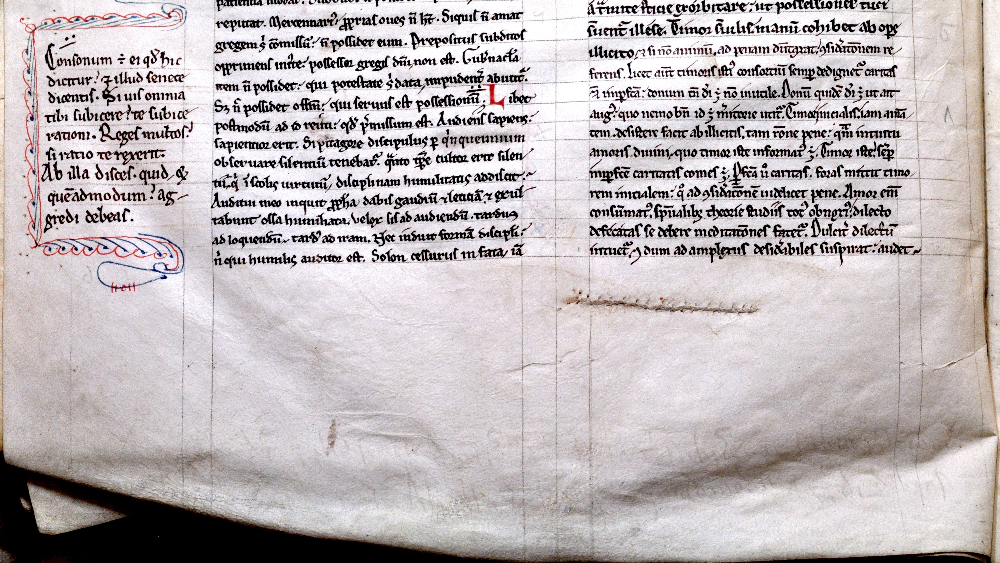

The work's unfinished state becomes more apparent as it progresses, revealing that the manuscript was copied while Alexander was still in the process of composition. This is most visible through changes in scribes at appropriate points in the text. Alexander closes his discussion of Prov. 1:6 at fol. 62rb with a personal remark: 'Set ecce fateor⸵ quia egre dediscitur usus.' When the text picks up again, adding a transitional sentence and moving on to Prov. 1:7, the hand is markedly different. The text's state of completion quickly degrades as the work proceeds. It begins much in the style of his commentaries on Ecclesiastes and the Song of Songs, with a formal proem, followed by a confident declaration, 'Incipit liber primus. Capitulum .i.' on fol. 59va. The only other heading indicating a chapter is for the second, on fol. 60rb, but it can be seen that more were intended from the scheme of initials at appropriate places, and references in the text itself to a chapter structure.

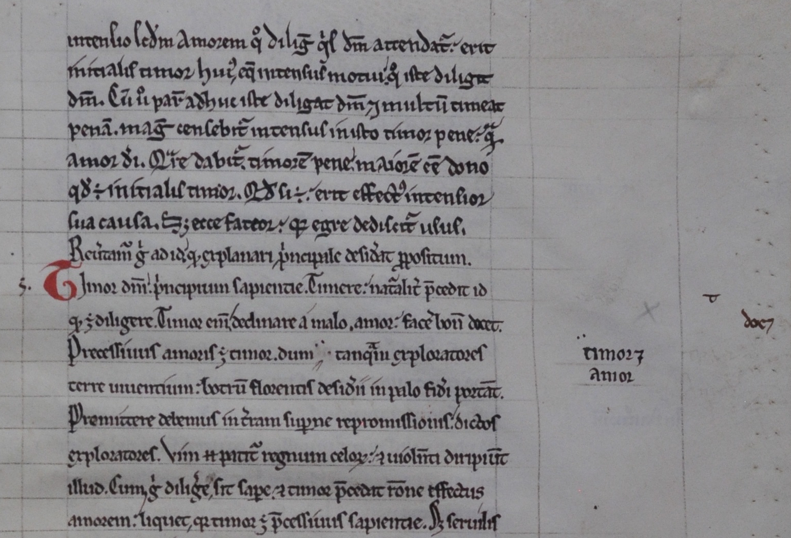

From fol. 72 until the end of the text, the shifts in hand become more frequent, as if Alexander were working on the text in short spurts. A catchword is found at the bottom of fol. 72vb, the end of gathering 8: 'Requi[re?] in libro. Et bene.' The following gathering is in a different hand and on a different grade of parchment, and the text quickly lapses into verbatim quotations of Bede on Proverbs. The remainder of the gathering was originally blank; two sermons were later copied into fols 74v–77v under Alexander's name, but one of these is by Peter Comestor, and the other does not match Alexander's style [@hunt:1984schools, pp. 22–23, 150].

The state of this manuscript is highly instructive of Alexander's working methods, and shows that the scribes were working from a written exemplar. If Alexander had dictated the book directly, it is unlikely that he would have taken the time to read from Bede. He appears to have made written extracts of passages he wished to cite, which he worked into a draft for his scribes. One imagines that Alexander was consumed by administrative duties or died at this point, and that either he or a fellow canon caused his remaining loose notes to be copied into the manuscript for posterity.

#### *Tractatus super Mulierem fortem*

Alexander's *Tractatus super Mulierem fortem* is corrected in a similar way to the Proverbs commentary, but while Alexander was revising the latter work before its completion, the bulk of the revision here was done somewhat later. This is revealed through collating the text with Oxford, Bodleian Library, MS Bodley 528 (*SC* 2221), from Reading [where it was recorded in @mynors:1991registrum, R42.3]. While Mahoney states that 'no relationship may be established between the MSS. that would suggest one as the possible source of the other' [@mahoney:1971critical, p. vii, repeated at xi], he came to this conclusion only because he did not record the readings of Jesus College 94 from before its correction. This work is much more discursive than Alexander's wisdom commentaries, and there is no suggestion of divisions into chapters. His conception of the work appears to have changed as it progressed: its structure suggests that only the first book, on Mary Magdalene, was part of the original plan. Unlike the first, the second and third books (respectively on the Virgin Mary and the Church) include marginal labels: only an abortive attempt has been made to add these to the first book, at fols 96r and 97v. The later books are also identified using running heads. One can therefore identify at least three major stages of the work: the creation of book 1; the addition of books 2 and 3, after which Bodley 528 was copied from the manuscript; and the later correction by Alexander Neckam.

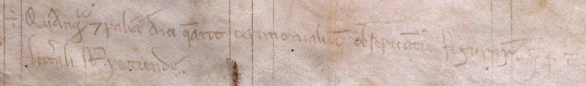

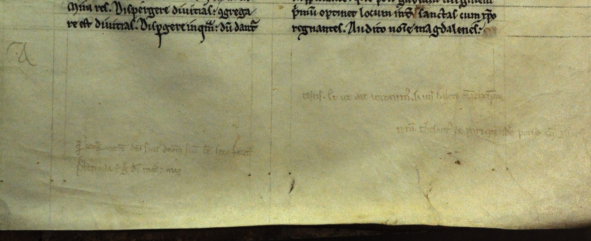

### Other Manuscripts

@gullick:1990twelfthcentury [pp. 21–23] discovered that Alexander can be found correcting and annotating a copy of the letters of Thomas Becket (London, British Library, Cotton MS Claudius B.ii), noting Alexander's habit of arranging marginal notes in the form of a reversed triangle – a form repeated even in the marginal notes of copies of Alexander's works. He also adopts a slightly unusual form of punctuation that appears to have been unique to Gloucestershire [@ker:1960english, p. 48 and pl. 20b]. There are many more Cirencester manuscripts that have hand that might be identified as Alexander's, but it is difficult to make a definite judgement due to its similarity with that of his clerk, Walter de Melida; one such book is Oxford, Jesus College, 48 which includes on fol. 85 an extended note on marital consent at the end of the 'Speculum ecclesie quod abbas sancti uictoris ex dictis sanctorum patrum compilauit', as it is entitled in this copy (often attributed erroneously to Hugh of St Victor).

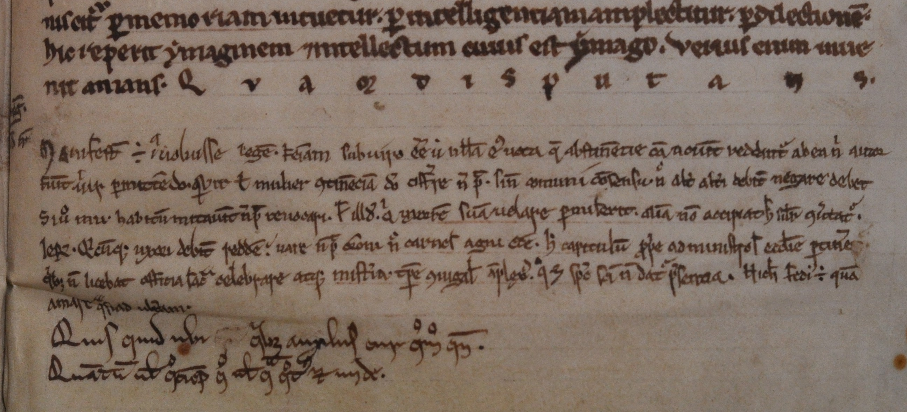

## Walter de Melida as Alexander's literary executor

Alexander had a literary executor of sorts in Walter de Melida (alternatively Melide or Melidie; this spelling chosen on the basis of his autograph in Canterbury, Cathedral Library, MS Lit. B.13, fol. 67r).<!-- BL spelling? --> A document dated June 1200–July 1205 found in the Cirencester cartulary first refers to him by his full name and later as 'magistro Waltero' [@ross:1964cartulary, pp. 1:295–296 (no. 327/186), 'fratrem uero Walterum de Melide constituit socium Alani celarii jta tamen quod predictus Alanus precipuam et plenam habeat amministracionem tam jnfra cepta curie quam extra super omnibus que ad officium celarii pertinent': discussed at 1:xx; @cheney:1986canterburya, pp. 77–78 (no. 410)]. This appoints him an assistant to Alan the cellarer: together, they are responsible for reporting to the bishop of Worcester and the archdeacon of Gloucester anything the abbot of Cirencester might do that contravenes the arrangement made by this charter. The same document confirms that he is not to be identified with Walter of Gloucester, later abbot from 1217–30.

In September 1212, a Walter was paid for taking a message from the king to Alexander, referred to specifically as the clerk of Alexander ('Waltero Clerico suo' and 'Waltero Clerico Magistri Alexandri Nequam eunti in nuncium domini sui') [@cole:1844documents, p. 242 (*Rotulus misae*, 14 John); cited in @hunt:1984schools, p. 13]. A 'W. clerico' also witnesses a charter for Alexander in 1213–17 [@ross:1964cartulary, pp. 2:413–414 (no. 465)]. There are several other Walters in the Cirencester cartulary that might refer to the same person. Various administrative roles are filled by a 'Waltero capellano' or 'magistro W. capellano' in 1203, 1208, and 1218–36 [@ross:1964cartulary, pp. 2:502 (no. 582), 2:525 (no. 613), 2:340–42 (nos. 378/404, 379/403)]. Documents are found witnessed by a 'Waltero clerico' in 1176–81, 1176–93, 1198–1200, and the early thirteenth century [@ross:1964cartulary, 2:597 (no. 720), 2:565 (no. 673/871), 2:561 (no. 666/537), 2:568 (no. 680/895)]. It may be the same 'Walterum clericum' that holds the position 'capellanus de Bachampt'' (Beckhampton, 40 km south of Cirencester) *c.* 1190–93 [@ross:1964cartulary, p. 2:429 (no. 487/743)]; a 'Walterus rector capelle de Bach'' also occurs *c.* 1235 [@ross:1964cartulary, p. 2:431 (no. 488/740)]. There is also a reference in a document of 1187–1208 to a 'terram que fuit Walteri Clerici' [@ross:1964cartulary, p. 2:345 (no. 383)], while an undated thirteenth-century document refers to a 'terram Walteri capellani' [@ross:1964cartulary, p. 3:983 (no. 627)].

Walter's name refers to Mileto, Calabria, which is called Melide in the chronicle of Roger of Hoveden, noting that Richard I stayed at the town's abbey of the Holy Trinity on 21 September 1190 [@stubbs:1868chronica, p. 3:45; @riley:1853annals, p. 2:157]. This abbey was established by Roger I, the Norman count of Sicily [@occhiato:1978labbatiale; @loud:2007latin, pp. 88–89].  One can also find a Peter de Melide a few decades earlier [@bigelow:1879placita, pp. 312–313]. Walter might have been a Norman from Roger's Augustinian foundations at Bagnara.

As a canon, Walter acted as a highly literate administrator. His position as *socius* to Alan the cellarer recalls the position of Reginald of Priverno, *socius continuus* of Thomas Aquinas, who acted as a combination secretary and companion [@spiazzi:1995san, pp. 109-110]. He seems to be responsible for an angular hand that is remarkably similar to Alexander's, but with a hooked descender for the 'g', and in some texts with flourished capital letters. This script can be found at length at the end of Oxford, Bodleian Library, Laud Lat. 17, a set of letters appealing a ruling that concerned several abbots, including that of Cirencester. These can be dated to 1200–13 based on the individuals named.

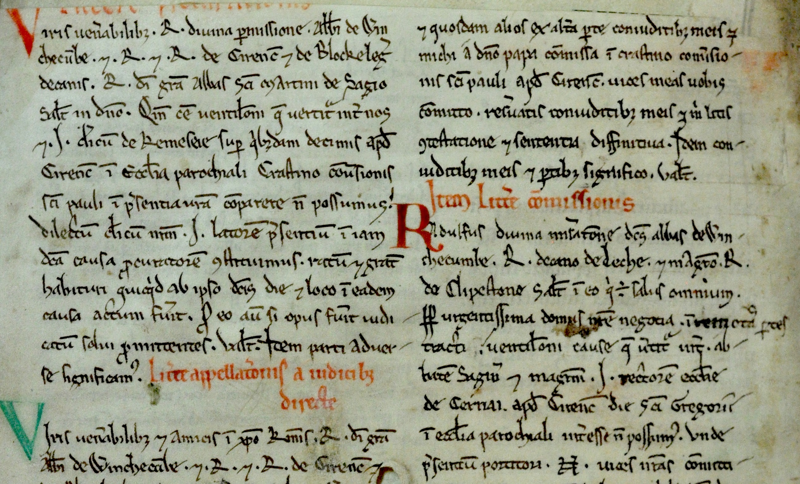

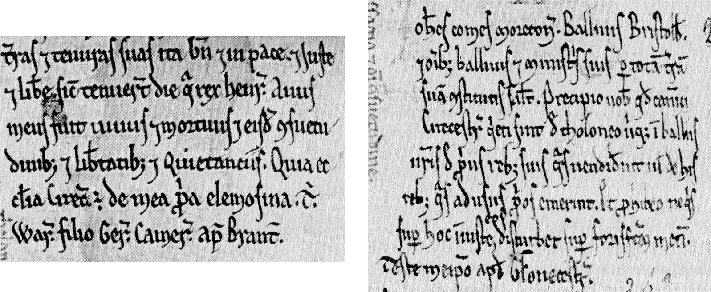

Among the scribes named in the colophons to the Cirencester books produced in the twelfth century, one is found named Walter who took a keen interest in textual variation. London, British Library, Royal 7 F.vi, a copy of Paterius, once contained an inscription reading 'Liber est Marie de Cirecestre D. Andree abbatis secundi eiusdem loci tempore scriptus per manum Walteri canonici et diaconi, D. Adam de Lamora tunc cantore' [@warner:1921catalogue, 1:200–201 (and vol. 4, pl. 56e); @watson:1979catalogue, no. 879; cited in @gullick:1996scribe, pp. 4, 27]. Andrew was abbot from 1147 until 1176, while Adam de Lamora's dates are not known, but he was followed in office by Alexander of Wellow, under whom four manuscripts were completed, meaning that the book most likely dates to the 1170s [@gullick:1996scribe, p. 5]. Gullick identifies Walter as 'Scribe A' of four further Cirencester manuscripts, where he appears not only to be working with another scribe but to be in charge of ensuring the texts' accuracy: part of one of the Cirencester cartularies (Marquess of Bath, Longleat 38b), not begun before 1182; parts of a copy of the letters of John of Salisbury, now Oxford, Bodleian Library, Barlow 48, whose exemplar could not have been produced before 1187 [@webb:1909ioannis, p. 1:xvi]; part of Robert of Cricklade's *De connubio Iacobi* in Hereford, Cathedral Library, P.iv.8; and a copy of the letters of Thomas Becket in London, British Library, Cotton Claudius B.ii, also annotated by Alexander Neckam [@gullick:1996scribe, pp. 4–15]. Walter personally corrected many of these manuscripts and added editorial judgements in the margins, as can be seen for example in Oxford, Bodleian Library, Barlow 48, fol. 64rb. Analysis of his work shows that Walter can be viewed as a textual critic in his own right [@duggan:2000correspondence, pp. 1:lxxxv–xciii].

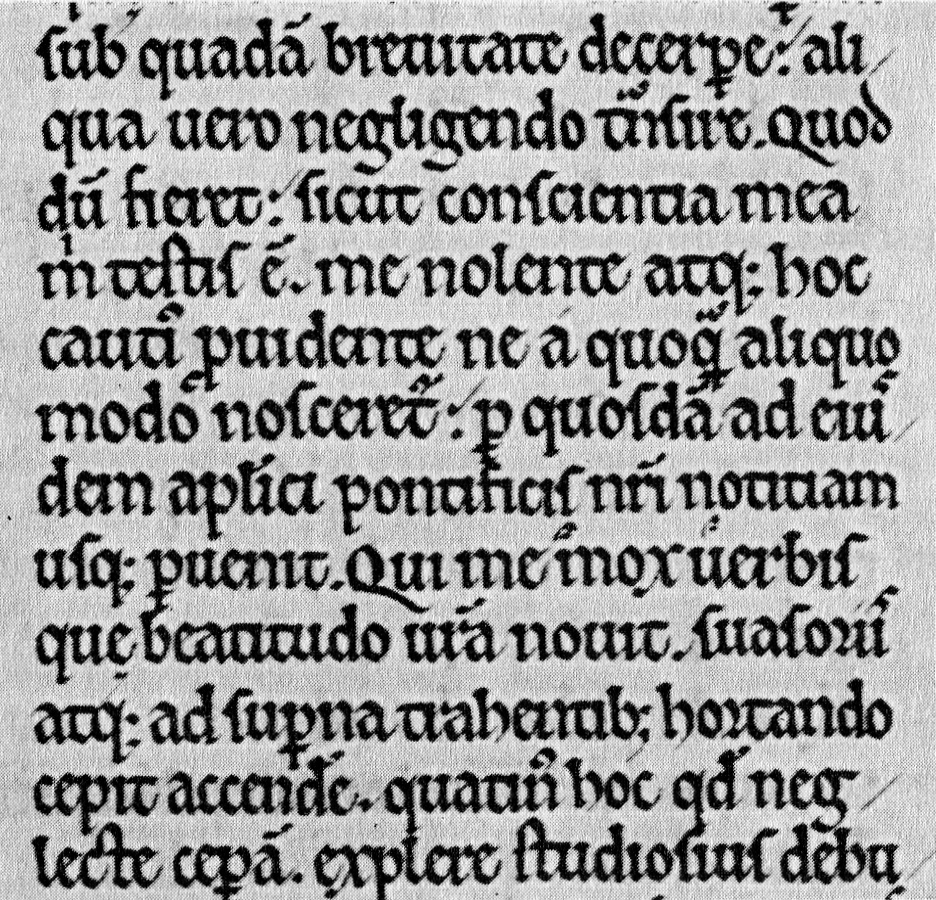

Walter the scribe must have been highly trained to produce work of such quality, and it is highly probable that Walter the scribe was the same as Master Walter de Melida. The version of his script in the Longleat cartulary is highly similar to that of Laud Lat. 17. This would give him a career at Cirencester from at least *c.* 1175 until after the death of Alexander Neckam in 1217, a period of over forty years, which would require him to have lived until at least sixty-five if one leaves room for a master's education (Alexander lived to sixty). This fits with the document making him a *socius* between 1200 and 1205, which implies that Walter was among the more senior canons in the house.

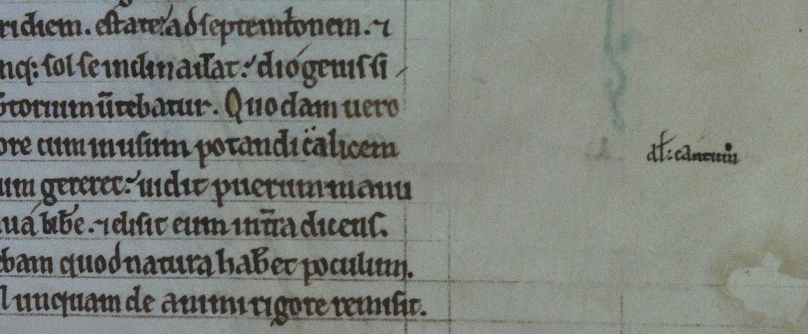

As the *clericus* of Alexander, Walter was much more than an administrative assistant: he seems to be responsible for the second hand that corrects Alexander's manuscripts, noted by Hunt. This hand follows Alexander's style of roughing in additions to be entered formally by other scribes, which makes it difficult to distinguish in many cases. Along with additions to the commentaries on Proverbs and the *Mulierem fortem*, he may be responsible for some of the corrections to Oxford, Magdalen College, MS 139, though there are several hands at work in this manuscript. This is a copy of *De naturis rerum* written in an identical style to the Cirencester copy of the *Tractatus super Mulierem fortem*, and presumably originating from the abbey. Titles have been added to many chapters, reflecting two different textual traditions: one including numbered chapters with headings in the later books, and one lacking these. He may also be the annotator of London, British Library, Royal MS 7 F.I, containing Alexander's *Speculum speculationum* [@thomson:1988alexander, p. xx also argues against identifying this hand with Alexander]. The hand corrects most of the text, but does not revise it: where longer additions occur, they can be explained as corrections from an exemplar. This work was also unfinished at Alexander's death, and this correction work appears to have been part of Walter's activities as a sort of literary executor for the abbot.

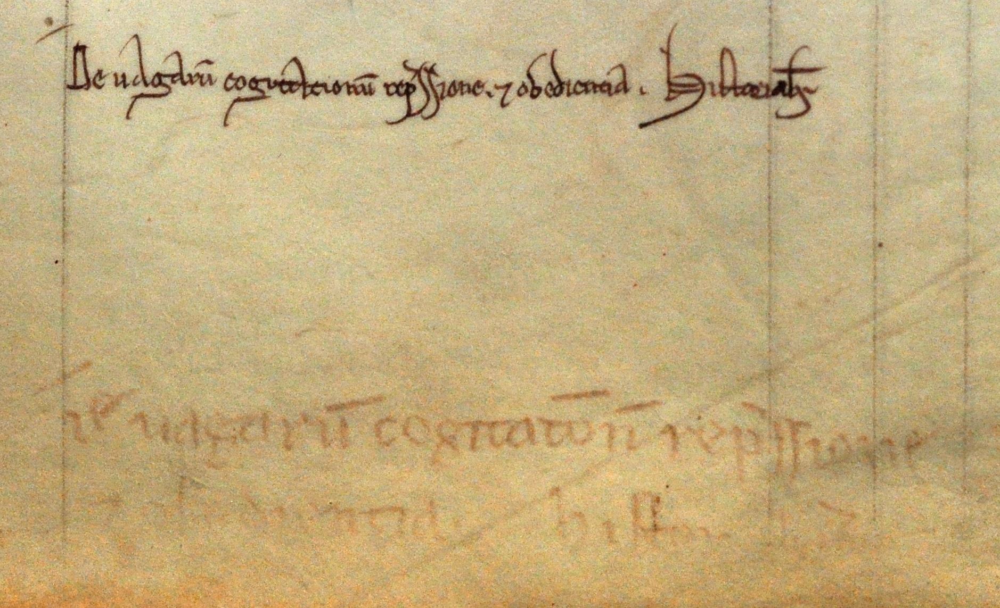

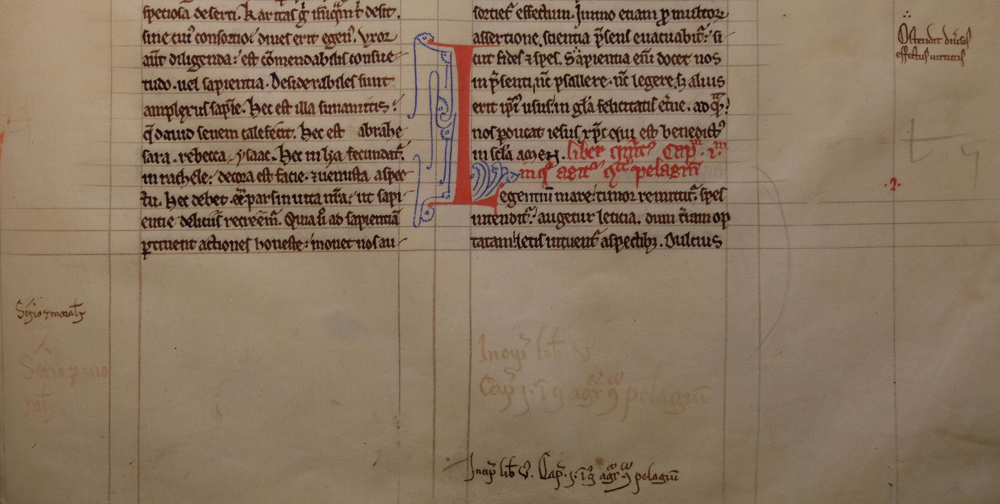

### Walter's edition of Alexander's sermons

The most vivid evidence for Walter's work comes in the form of correspondence with two Benedictines. One appears in Canterbury, Cathedral Library, MS Lit. B.13, which includes a number of sermons written by Alexander; it was owned by Roger Noreys, a monk at Christ Church, Canterbury in the early thirteenth century [@greatrex:1997biographical, p. 244 identifies him with the controversial abbot of Evesham, but this is unlikely; see @sayers:2004norreis]. He gave a number of books to its library, the number of which is somewhat ambiguous in the catalogue: it might be either eleven or sixty-four, depending on how it is read. These included a copy of Alexander's *De naturis rerum* [@james:1903ancient, p. 102 (no. 1106)]. It originally lacked the end of Alexander's sermon 39 [for a listing of Alexander's sermons, see @hunt:1984schools, pp. 150–153]. Roger seems to have asked about this on a trip to Cirencester. Walter supplies the requested end of the sermon, asking in return for a list of the available sermons by Alexander, as quickly as possible:

> W. de Melida, to his beloved in Christ and friend, the most dear R., chaplain to the archbishop, greetings and himself. I am sending you the end of the sermon beginning, *Thou shalt arise, and have mercy upon Sion.* [Ps. 102:13] I also ask you to mark on some sheet the beginnings of all the sermons that you have in your possession and send them to me by the first messenger<!-- better trans? 'embassy'? --> you can find. For I found after you left me, as if it happened by the will of God, some sermons of master Alexander where other of his sermons are contained which you do not have in your possession, and because I do not accurately remember all those which you already have, send me the beginnings of them all, that I may thus have written those sermons which you do not have. Farewell.[^walter]

[^walter]: Canterbury, Cathedral Library, MS Lit. B.13, fol. 67r, quoted in @ker:1969medieval, 2:274:<!-- check in MS -->

    > Dilecto sibi in cristo et amico karissimo R. capellano arch*iepiscopi*. suus W. de Melida. Salutem et se ipsum. Mitto uobis finem sermonis illius qui sic incipit. Tu exurgens misereberis syon. [Ps. 101:14] Rogo etiam uos quatinus notetis in quadam cedula omnium sermonum principia quos habetis penes uos et mittatis michi per primum nuntium quem inuenire poteritis. Inueni enim postquam recessistis a me sicut uoluntas dei fuit quosdam sermones magistri Alex' [*erasure of twelve words*] ubi continentur alii eius sermones quos penes uos non habetis. et quia memoriter non retineo omnes quos penes uos habetis omnium principia michi mittite. ut sic sermones illos quos non habetis scribere faciam. Valete.

Walter is evidently quite eager both to spread Alexander's writings and collect them himself. This letter probably reflects the compilation of Oxford, Bodleian Library, MS Wood empt. 13 (*SC* 8601). This is a collection of most, but not all, of Alexander's sermons (lacking, for example, a few found in the Canterbury manuscript), organized to follow the church year. The manuscript belonged to St Augustine's in Canterbury, but it is possible that it was originally one of the sermon collections found in the list of books belonging to Roger Noreys. The angular hand identifiable with Walter can be found on fol. 2v.

### Walter's correspondance with Malmesbury on *Corrogationes Promethei*

A second letter is from S., prior of Malmesbury, writing to Walter on his admiration of Alexander's work, and focusing particularly on the *Corrogationes Promethei*: he does not refer to the book by this title, but describes it as being about the meanings of words, designed as an introductory work for the instruction of boys, and having a prologue, which leaves no other options. There seems to have been a special affinity for this work at Malmesbury: it was the source for several additions to *Sol meldunensis* (Cambridge, University Library, Gg.6.42). The letter occurs at the end of the verse anthology in Paris, Bibliothèque nationale, MS lat. 11867, fol. 240va–b; and in a copy of *Corrogationes Promethei* from Sempringham Priory, now London, British Library, Royal 5 C.V, fol. 57rb–vb [an earlier part of the letter is quoted from the Paris manuscript in @meyer:1896notice, p. 657n1; summarized in @hunt:1984schools, p. 12; the letter found in Évreux, Bibl. Mun., 72, fol. 1v is a different text, in spite of the claim of @hunt:1984schools, p. 131]. S. refers to Alexander in glowing terms: 'For he has not only accepted gold, but is entirely clothed in it.'[^gold] The prior eludes further identification, though he is also noted in a document from 1246 [@jones:1891charters, p. 301; cited in @russell:1932alexander, p. 265n8]. Following this effusion in Alexander's praise, he comes to a puzzling conclusion:

> These are my thoughts […]. You will have seen whether they are agreeable and clear. My mind suggests to me in faithful testimony not to write too much. I hope these are pleasing to you; if they are not, let me know first what displeases.[^displeases]

[^displeases]: Paris, BnF, lat. 11867, fol. 240vb:

    > Hec mea sententia […].<!-- Find out what is in BL: P illeg. --> Vos uideritis utrum bene et plene. Mea michi mens fideli testimonio suggerit⸵ non extasse in uerbo. Vtinam hec uobis placeant. sin autem. michi primum notificate quid displiceat. Valete karissime.

[^gold]: Paris, BnF, lat. 11867, fol. 240va–b: 'Non enim solummodo aurum recipit⸵ sed et auro tota uestitur.'

S. cannot be concerned that Walter will find his views on Alexander controversial; rather, it is the style that might need adjustment, seeking to fit a particular purpose that was requested. The terms in which he speaks of Alexander suggest that he is writing after the abbot's death, and Walter might have solicited an encomium from Malmesbury to commemorate his work.

The letter might also have been intended to accompany a new edition of *Corrogationes Promethei*, or even a projected collection of Alexander's works similar to that created for Hugh of St Victor. Some evidence for such a campaign might be discernable in the consistency and dating of surviving manuscripts. Most copies of *De naturis rerum* have a remarkably consistent appearance, and largely date from the same period. This is apparent enough that it was noted even by Wright, who observed that there was a pattern of consistent marginal titles in his manuscripts, suggesting that they were part of the original [@wright:1863alexandri, p. lxxvii]. Yet the same can also be said of *De nominibus utensilium*, of which there are many more copies, and was one of Alexander's earlier works: most of its manuscripts are of a similar size, and they almost universally leave space between the lines of the main text for glosses – probably because scribes understood that this was the work's purpose. The Paris anthology itself is structured in a haphazard fashion, giving the air of a collection of half-edited loose notes that might have been available at the end of Alexander's life, hastily assembled into a volume. It does not seem possible to know the precise purpose of this letter, but it does show that

## Results of the dissemination effort

By combining the number of surviving manuscripts with medieval library catalogues and other booklists, one can get a sense of the relative success of Alexander's work. This data must be used with some caution, since the vast majority of records represent institutional holdings, and only a fraction of the catalogues that existed survived the dissolution of the monasteries; of these, an even smaller number are available in an accessible format than from the continent, and these overwhelmingly represent the British isles. The table below does not count records (listed in [Appendix A: Alexander's Works]) that are matched to a surviving manuscript. The provenance of many surviving manuscripts has not yet been identified, meaning that there will be some duplication between the surviving manuscripts and records. Nonetheless, it can be seen that Alexander's most popular works are also his most practical creations: *Corrogationes Promethei*, followed by *De utensilibus*.

| Work                              | Manuscripts | Records | Total |
|-----------------------------------|-------------|---------|-------|
| *Corrogationes Promethei*         |          34 |      48 |    82 |
| *De utensilibus*                  |          33 |      19 |    52 |
| *De naturis rerum*                |          15 |      29 |    44 |
| *Laus beatissime uirginis*        |           8 |      13 |    21 |
| *Expositio simboli*               |           5 |       7 |    12 |
| *Nouus Esopus*                    |           7 |       4 |    11 |
| *Laus sapientie diuine*           |           6 |       5 |    11 |
| *Glose super Psalterium*          |           4 |       7 |    11 |
| *Super Mulierem fortem*           |           2 |       5 |     7 |
| *Corrogationes Promethei metrice* |           3 |       3 |     6 |
| *Super Martianum*                 |           2 |       4 |     6 |
| *Nouus Auianus*                   |           3 |       1 |     4 |
| *De commendatione uini*           |           3 |       0 |     3 |
| *Meditatio de Magdalena*          |           1 |       2 |     3 |
| *Questiones*                      |           1 |       2 |     3 |
| *Super Parabolas*                 |           1 |       2 |     3 |
| *Corrogationes noui Promethei*    |           1 |       1 |     2 |
| *Sacerdos ad altare*              |           1 |       0 |     1 |
| *Solatium fidelis anime*          |           1 |       0 |     1 |
| *Speculum speculationum*          |           1 |       0 |     1 |
| *Suppletio defectuum*             |           1 |       0 |     1 |

There is nothing surprising in the widespread copying of *Corrogationes Promethei* and *De utensilibus*; the former would have been a useful tool for anyone needing to work with the Bible. Several institutions even list multiple copies, suggesting that it was in demand as a reference work; the Benedictines of Christ Church, Canterbury may have owned as many as eight, according to the catalogue compiled by Prior Eastry before the end of 1331. Most copies of *De utensilibus* have been personalized in small ways, providing slightly different versions of the Anglo-Norman glosses. What is more surprising is the success of *De naturis rerum* and to a lesser extent *Laus beatissime uirginis*, given their monumental size; in some ways, this represents more of an accomplishment.

Alexander gained an appreciative readership during his lifetime, and the Cirencester canons were keen to continue promoting his work posthumously. There is little evidence for the means by which he undertook his literary work at Oxford, but the first booklet of Jesus College 94, containing his gloss on the Psalter with autograph corrections, was almost certainly produced there. The presence of copies from this text without the corrections shows that he had the means to publish his work from Oxford, but he may have had to arrange this on an individual basis. At Cirencester, he had access to a scriptorium that was already highly organized, allowing him to produce fair copies of works even as they were being written, and providing him with an ally who assisted in the correction and presentation of his books, even after his death. As can be seen from the letters of Walter de Melida, this activity provided the canons with a means to promote relationships with neighbouring houses, as will be seen in the case of *Sol meldunensis*, a florilegium of Alexander's works assembled by his nephew.
