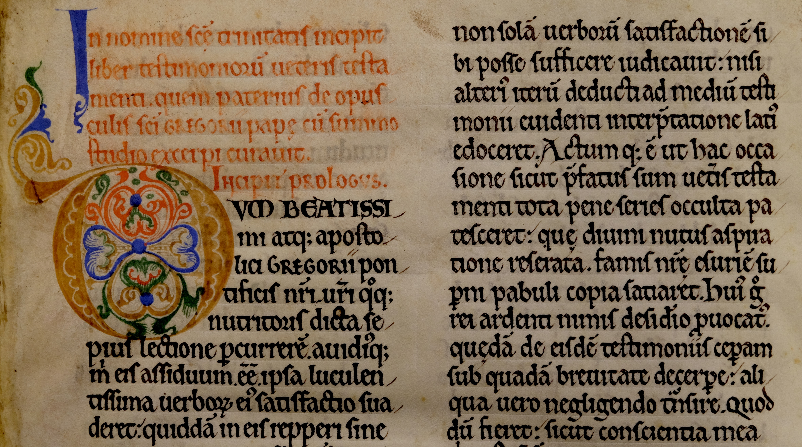

# Disseminating Alexander's Works

The Augustinian influence in Alexander's career not only defined the character of his writings, but also the form in which they were published. Scholars are often unwilling to speak of 'publication' in a medieval context, with the specific modern connotation of printing a work [cf. @riddy:2010publication]. It might be more accurate to suggest that the process of printing, rather than being a prerequisite for true publication, merely hastened and intensified the process of the commercialization of book publication. Medieval authors conducted similar activities of editing and revision to their modern counterparts, and 'published' their work in the literal sense of the word's origin in *publicare*, to make public. Richard Sharpe, examining the work of Anselm of Canterbury, has shown that the medieval equivalent to what is today called publication is better found in the term *edere*, 'to bring forth' [@sharpe:2009anselm, p. 1n2]. Research on other authors of the twelfth and thirteenth centuries has shown the extent to which their work cannot be understood outside their institutional context. Authors' success was dependent not only on the excellence of their work, but on the availability of a community that would aid in the production and promotion of writing both during their lifetime and after their death.

Alexander was no a stranger to the publishing process when he came to Cirencester. It stands to reason that at least some of Alexander's works could also have been produced there, but it is difficult to know which ones. One manuscript that can plausibly be attributed to his time at St Frideswide's is the first booklet of Oxford, Jesus College, MS 94, which contains his gloss on the Psalter. The last two booklets were produced at Cirencester, and contain his unfinished commentary on Proverbs and his *Tractatus super Mulierem fortem*. These provide insight into his working methods, showing that he continued to edit his works after they were first published, like many of his contemporaries, with copies representing the unrevised text continuing to circulate. They also hint at a concerted effort to disseminate his works after their completion. He was assisted by his fellow canon Walter de Melida, named variously as a *socius*, *capellanus*, or *clericus* in the Cirencester cartulary. Two surviving letters document Walter's enduring concern to catalogue and distribute Alexander's works after the abbot's death, building relationships with other nearby religious communities.

## The importance of institutional context to twelfth-century writers

The corpus of Hugh of St Victor, who so deeply influenced Alexander Neckam, exemplifies the prominent role an Augustinian house could take in setting the course of the reception of an author's writings [recent scholarship on this is summarized by @berndt:2011writings]. After Hugh's death in 1141, an edition of his complete works was created at the order of his abbot, Gilduin. This effort involved both cataloguing Hugh's known works and organizing them into four thematic volumes, allowing easy reference and copying. The existence of this effort and its results was discovered only though a document entitled *Indiculum* that lists the contents of these original four volumes, which survives by chance in a fifteenth-century copy, now Oxford, Merton College, MS 49 [first published in @deghellinck:1910table]. It stands to reason that many other such efforts could be found with more careful examination of the evidence. None of the original manuscripts survive, though a direct and contemporary copy from St Victor survives in Paris, Bibliothèque Mazarine, MS 711, produced between 1141 and 1150 [see especially @stammberger:2005edition; @poirel:2002livre, pp. 27–86; Hugh's *De quinque septenis* is edited from this manuscript in @dunning:2016hugh]. It has become increasingly apparent that this edition was enormously influential in establishing the form and contents of Hugh's corpus, and in promoting its dissemination. It is also a useful basis for understanding Hugh's thought within his historical context. Paul Rorem has written a successful introduction to Hugh by working through his major works in the order they appear in the *Indiculum* [@rorem:2009hugh, pp. 13–14]. An effort is now underway to recreate the text of this edition [@berndt:2008hugonis, p. 15]. Hugh was also fortunate to have been associated with a well-endowed house that had the resources to continue promoting his work into the modern period, with editions of his *opera omnia*, as well as those of Richard of St Victor, serving in part as a means to promote that house and coalesce its identity [@quantin:2010réception].

Institutional support can, indeed, be found behind almost every medieval author whose works became widely known and survived in any numbers into the present day. William of Malmesbury worked with at least four other assistants to acquire books and make copies of his own [@thomson:2003william, p. 77]. Peter of Blois benefited from his position in government in fostering the dissemination of his letters [@southern:2004blois]. Even the works of a minor author such as Samuel Presbiter survived because his connection to Bury St Edmunds allowed him to assemble his works into two matching edited volumes, later preserved in the abbey library [@dunning:2016samuel, pp. 10–12]. No medieval writer worked alone.

Alexander's work with other scribes is most obviously demonstrated by his own descriptions of the mechanics of publishing. His remarks in *De utensilibus* and *Sacerdos ad altare*, both works designed for teaching Latin, indicate a personal interest in the practicalities of writing. The former treatise is detailed enough that a scribe's writing desk has been reconstructed primarily based on its description [@vezin:2005reconstitution; for other codicological uses of Alexander's descriptions, see @gasparri:2007terminologie; @copeland:2010naming]. These works also provide some of the best descriptions that survive of tacketed bookbinding [@gullick:1996scribe, p. 240; cited in @gumbert:2011tacketed, p. 303n12, who suggests an emendation to the text, discussed at 318–20]. Contemporary manuscripts surviving from Oxford and Cirencester, some of which include annotations from Alexander himself, give us a glimpse into Alexander's own working methods, and into the process of disseminating his works during his life and in the decades following his death.

## Scribal additions to Oxford and Cirencester manuscripts

<!-- One of the most exciting aspects of studying medieval texts is the possibility of reading the same volumes that authors themselves worked on. Medieval autographs are constantly being discovered; among the most famous are writings in the hand of Thomas Aquinas and Albert the Great [the classic article on medieval autographs is @lehmann:1920autographe; updated, @lehmann:1941autographe]. Less studied, but probably even more common, is the situation in which a book survives that was not copied but corrected by its author. This can be difficult to detect, and the identification is often debatable.

There are a number of authors from twelfth- and thirteenth-century England whose works have been found in autograph. The flexible nature of historical writing lends itself particularly well to discovering authorial modifications, and some of the most interesting examples from this period include William of Malmesbury [@ker:1944william], Matthew Paris [@vaughan:1953handwriting; @vaughan:1958matthew], and probably Ranulph Higden [@galbraith:1959autograph]. Common to these are the substantive revisions one would immediately associate with revised manuscripts: typically these not only consist of revisions but of erasure and the modification of existing material. Matthew Paris, for instance, adds to the margin of his *Gesta abbatum* an anecdote explaining Alexander Neckam's unusual name. He presumably learned of it after the passage was originally composed, and added it at an appropriate point in the chronology. Studies have also consistently noted the presence of tinkering with more detailed aspects of the work: changes to paragraph structure, chapter divisions, spelling, and especially punctuation. These details often do not come out in editions of these works, because modern editors usually modernize all punctuation and almost always omit it from their critical apparatus. -->

### Oxford, Jesus College, 94

<!-- Wallis says: Description of Jesus College 94 needs clarification. Explain exactly how the style of the first booklet is not comparable to that of Cirencester MSS. The comparanda on fol. 52 (e.g. Royal 2 C XI) need dates and identification. Also Bodley 528 (p. 56). -->

It was first proposed by @hunt:1984schools [pp. 30–31] that Oxford, Jesus College, MS 94 preserves Alexander's handwriting. Still obscure are the origin of its *Glose super psalterium*, and the identity of a hand that is similar to Alexander's but differs markedly. This script can now be identified with Walter de Melida, Alexander's clerk, who probably assembled the volume in its final state. Both use what has been called a 'charter hand', commonly found in courtly documents of the twelfth and early thirteenth centuries [for examples, see @bishop:1961scriptores].

{#fig:figure4.1}

Jesus College 94 once belonged to Cirencester, and consists of three separate booklets. The volume is collated i, 1^8^, 2^10^–4^10^ (the last of these gatherings marked ·iiii·), 5^10^ (·ix·), 6^8^ (·x·) | 7^8^, 8^8^, 9^8-1^ (8 cancelled) | 10^8^–14^8^, 15^6^, 16^4^, for a total of 129 parchment leaves (illustrated in [@fig:figure4.1]). These contain, respectively, Alexander's gloss on the Psalter; his unfinished commentary on Proverbs, to which have been added two spurious sermons; and his *Tractatus super Mulierem fortem*.

#### *Glose super psalterium*

It is immediately apparent from the smaller size of this section (330–43 × 272–85 mm) in comparison to the rest of the manuscript (354–92 × 266–97 mm) that it has a different origin from the other booklets. It is heavily worn, and represents the remnants of a much more extensive manuscript. Its text is incomplete due to lost gatherings, as can be seen from the manuscript's collation. Alexander's gloss on the Psalter is directly linked to his teaching work, representing his lectures on this text. Hunt notes a reference to the Third Crusade in the work, meaning that it must have been completed after 1193; he also notes that it must have been written after he joined the Augustinians [@hunt:1984schools, pp. 26-27]. He assumes this means that it must have been completed at Cirencester, probably influenced by the prominent *ex libris* mark.[^exlib] This is followed by a further rubric, 'Glose magistri Alexandri abbatis cyrenc' super psalterium.' Both of these are later additions to the manuscript: the *ex libris* is written in a fourteenth-century cursive, and the rubric was not intended as part of the original page design, written above the text block in a different shade of red from that used to highlight the letters of the first line. This rubric can only be used to demonstrate that the book was owned by Cirencester in the thirteenth century. The style of the rest of the booklet is entirely unlike other manuscripts produced at Cirencester.

[^exlib]: Oxford, Jesus College, 94, fol. 1r:

    

    > Liber sancte Marie Cyrencestr' in quo continentur glose super psalterium quam composuit Magister Alexander \
    > Item tractatus super principium parabolarum et finem Item tractatus super Mulierem fortem
    

The booklet containing the gloss is instead the only known manuscript of Alexander's whose production can plausibly be attributed to St Frideswide's. The text is far more extensively revised than any other of his works, increasing the number of references to the biblical *Glosa* and other commentators and even adding new lemmata (@fig:figure4.2). The other works in Jesus College 94 only make relatively minor improvements to the text, with occasional additions of new biblical quotations. Alexander would have had far more reason to make these changes while he was lecturing on the text; it is most plausible that the book represents the working copy from his lectures.

{#fig:figure4.2}

The case that the additions to the manuscript belong to Alexander is strengthened by their integration into London, British Library, Royal MS 2 C. xi. The Royal manuscript also makes additional adjustments to the text, adopting the additions but also tidying them slightly [cf. @hunt:1936alexander, pp. 266–271, an extract from the commentary to Psalm 4]. The nature of these additions indicates that Jesus College 94 could not have been copied from the Royal manuscript. London, Lambeth Palace, MS 61, represents the uncorrected state of the text. Oxford, Bodleian Library, MS Bodley 284 (*SC* 2339: from Cirencester) also appears to follow this first recension, at least in places, but Hunt believed that it followed the second, and a full collation is required to establish the state of the text more precisely. Similarly to the gloss on the Psalter, there is an alternate recension of Alexander's commentary on the Athanasian Creed in Oxford, Bodleian Library, MS Rawlinson C.67 (*SC* 15517) [@hunt:1984schools, pp. 129–130], though its changes are much less extensive. While Hunt is hesitant to make a definitive judgement on the identity of the scribal additions to the gloss on the Psalter, there seems to be no other plausible explanation than that they are Alexander's, especially given the additional evidence provided by @gullick:1990twelfthcentury [pp. 21–23].

If the theory is correct and Alexander first wrote his gloss in his earlier days as a lecturer at Oxford, and revised it as he worked, this would also show that he had the means to publish copies from St Frideswide's. The only other book certainly known to have been produced at St Frideswide's in this period is now Paris, Bibliothèque nationale, MS fr. 24766; a note at the end of the text indicates that it was completed for St Andrew's Day, 30 November 1212.[^andrew] The implication is that brother A. was working alone. From Alexander's own time, there is also Prior Philip's *De miraculis sancte Frideswide*, uniquely preserved in Oxford, Bodleian Library, MS Digby 177; although this appears to have once formed part of a larger volume, it likely has an Oxford provenance [@macray:1999digby, p. 82], and additions at the end of the text may represent Philip's revisions. It is dangerous to work from an absence of information, but given the sheer lack of manuscripts from St Frideswide's, and the relatively unfinished state of production of the Jesus College 94 booklet of the gloss on the Psalter, the same may also be true for Alexander. He may have copied out his own work himself, working alone, or hired another scribe on an individual basis. The Lambeth copy of the first recension might have originated with a student, as was the case for many such works. If by moving to Cirencester Alexander gained access to its highly trained scribes, that house would have provided resources for publication much better suited to his work than he had at Oxford.

[^andrew]: [Paris, Bibliothèque nationale, fr. 24766, fol. 151r](http://gallica.bnf.fr/ark:/12148/btv1b8452207n/f313.item):

    

    > Explicit opus manuum mearum quod compleui. Ego frater A. subdiaconus. Sancte Frideswide seruientium minimus. Anno uerbi incarnati. .mº.ccº.xiiº. Mense .xiº. Ebdomada .iiiiª. feria .vi. In vigilia sancti Andree Apostoli. Anno conuersionis mee .viiº. Ad laudem et honorem domini nostro iesu cristi Qui cum patre et spiritu sanct viuit et Regnat deus per infinita secula seculorum. Amen.
    

A narrative for this booklet might follow: Alexander’s copy of his gloss on the Psalter was first produced at Oxford after 1193, after which some copies were made from the manuscript. He revised the text as he continued to teach as a canon at St Frideswide's, and brought the copy (by now somewhat bedraggled from use) with him to Cirencester. More copies were made at some point that included his changes in the text, and either he or another cleric revised the text mildly to integrate the additions more thoroughly. After Alexander’s death, the booklet was included in this manuscript in an attempt to assemble his lesser or unfinished biblical commentaries, and the compiler omitted booklets that had been lost or damaged. Bodley 284 might have been commissioned as a replacement.

#### *Super parabolas*

Alexander's commentary on Proverbs, *Tractatus super parabolas Salomonis*, forms most of the second booklet of Jesus College 94. This copy is unfinished, and it is unlikely that it ever reached a more advanced state. He only claims to have begun the work in *Speculum speculationum*: 'Memini autem me aliqua proposuisse super hoc in ingressu tractatus quem institui super parabolas.' [@thomson:2011alexandri, 3.81.1: London, British Library, Royal 7 F. i, fol. 68va] This did not stop copies from being made: one was owned by the Carmelite Hulne Priory [@humphreys:1990friars, F15.1], and another by the Dominicans at Lincoln [according to Leland's notes in London, BL, Royal App. 69, fol. 3r: cited in @hunt:1984schools, p. 137]. The only known excerpts from the work are found in *Sol meldunensis*; Oxford, Bodleian Library, MS Hatton 102 (*SC* 4051), fol. 200v, includes two passages that are cited from the commentary on Proverbs, but are from the *Tractatus super Mulierem fortem*.

{#fig:figure4.3}

Alexander revises the text as he works: the same hand from the gloss on the Psalter can be found making many additions in both this booklet and the *Tractatus super Mulierem fortem*. While the additions to the gloss focus on revising the content, Alexander is far more interested in smaller details within these booklets, modifying the punctuation and even changing the scribes' spelling usage. In the Proverbs commentary, there are only a handful of lengthy additions. These are roughed in by Alexander in the margin: they are in ink on the first few folios, and later in plummet. The plummet additions are recopied by a professional scribe with the addition of a decorative frame. As with the gloss on the Psalter, the purpose of the longer additions is typically to integrate additional quotations, as when a line from Job 29:18 is added to an already long collection of Old Testament references in the proem to Proverbs (fol. 57va, @fig:figure4.3). There are also many corrections of spelling that do not change the meaning of the text. Some of the corrections are made in a hand similar to Alexander's, but not the same: this belongs to Walter de Melida, Alexander's clerk.

<!--{#fig:figure4.4}-->

The work's unfinished state becomes more apparent as it progresses, which suggests that the manuscript was copied while Alexander was still in the process of composition. It begins much in the style of his commentaries on Ecclesiastes and the Song of Songs, with a formal proem, followed by a confident declaration, 'Incipit liber primus. Capitulum .i.' on fol. 59va. The only other heading indicating a chapter is for the second, on fol. 60rb, but it can be seen that more were intended from the scheme of initials at appropriate places, and references in the text itself to a chapter structure. Many of the shifts in hand correspond to transitions in the text, as at Prov. 1:6 (fol. 62rb), ending, 'Set ecce fateor⸵ quia egre dediscitur usus.' When the text picks up again, with a transitional sentence and a move to Prov. 1:7, the hand is markedly different (@fig:figure4.44).

{#fig:figure4.44}

The text's state of completion quickly degrades as the work proceeds. From fol. 72r<!--check--> until the end of the text, the shifts in hand become more frequent, as if Alexander were working on the text in short spurts. A catchword is found at the bottom of fol. 72vb, the end of gathering 8: 'Requi⟨re?⟩ in libro. Et bene.' The following gathering is in a different hand and on a different grade of parchment, and the text quickly lapses into verbatim quotations of Bede on Proverbs. The remainder of the gathering was originally blank; two sermons were later copied into fols 74v–77v under Alexander's name, but one of these is by Peter Comestor, and the other does not match Alexander's style [@hunt:1984schools, pp. 22–23, 150].

The state of this manuscript is highly instructive about Alexander's working methods, and shows that the scribes were working from a written exemplar. If Alexander had dictated the book directly, it is unlikely that he would have taken the time to read from Bede. He appears to have made written extracts of passages he wished to cite, which he worked into a draft for his scribes. One imagines that Alexander was either entirely consumed by administrative duties or died at this point, after the remaining loose notes were copied into the manuscript for posterity.

#### *Tractatus super Mulierem fortem*

Alexander's *Tractatus super Mulierem fortem* is corrected in a similar way to the Proverbs commentary, but while Alexander was revising the latter work before its completion, the bulk of the revision here was done somewhat later. This is revealed through a collation of the text with a copy from Reading, now Oxford, Bodleian Library, MS Bodley 528 (*SC* 2221) [it is recorded there in @mynors:1991registrum, R42.3]. While Mahoney states that 'no relationship may be established between the MSS. that would suggest one as the possible source of the other' [@mahoney:1971critical, p. vii, repeated at xi], he came to this conclusion only because he did not record the readings of Jesus College 94 from before its correction. *Super mulierem* is much more discursive than the other wisdom commentaries, and there is no suggestion of divisions into chapters. Alexander's conception of the work appears to have changed as it progressed: its structure suggests that only the first book, on Mary Magdalene, was part of the original plan. Unlike the first, the second and third books (respectively on the Virgin Mary and the Church) include marginal labels: only an abortive attempt has been made to add these to the first book, at fols 96r and 97v. The later books are also identified using running heads. There appear, then, to be three major stages of the work: the creation of book 1; the addition of books 2 and 3, after which Bodley 528 was copied from the manuscript; and the later correction by Alexander, Walter, and at least one other unidentified hand ([@fig:figure4.5; @fig:figure4.6]).

{#fig:figure4.5}

{#fig:figure4.6}

### Other Manuscripts

Gullick argues that Alexander can also be found correcting and annotating a copy of the letters of Thomas Becket (London, British Library, Cotton Claudius B. ii); he notes Alexander's habit of arranging marginal notes in the form of a reversed triangle – a form repeated even in the marginal notes of copies of Alexander's works [@gullick:1990twelfthcentury, pp. 21–23]. Alexander also adopts a slightly unusual form of punctuation that appears to have been unique to Gloucestershire [@ker:1960english, p. 48 and pl. 20b].

There are many more Cirencester manuscripts that have hands that might be identified as Alexander's, but it is difficult to make a definite judgement due to its similarity with that of Walter. While both hands have an angular appearance, Alexander often writes a high double-compartment 'a', and almost always uses a 'g' with a straight descender; Walter uses a single-compartment a with much higher frequency, and usually uses a hooked descender with his 'g'. In many texts, he places small flourishes on his capital letters.

## Walter de Melida as Alexander's literary executor

Analysis of Jesus College 94 shows that it was corrected by Alexander, but also that he was not working alone: apart from the scribes who copied it, there is at least one other corrector present, who is highly educated. This reviser can also be hypothesized as responsible for cleaning up the text, potentially after Alexander's death, and can be thought of as a sort of literary executor. A surviving autograph letter allows this script to be identified as belonging to another canon at Cirencester, Walter de Melida (alternatively Melide or Melidie).^[This spelling is chosen on the basis of his autograph in Canterbury, Cathedral Library, Lit. B. 13 (57, iii), leaf inserted after fol. 67.] A document dated between June 1200 and July 1205 found in the Cirencester cartulary first refers to him by his full name and later as 'magistro Waltero' [@ross:1964cartulary, pp. 1:295–296 (no. 327/186), 'fratrem uero Walterum de Melide constituit socium Alani celarii jta tamen quod predictus Alanus precipuam et plenam habeat amministracionem tam jnfra cepta curie quam extra super omnibus que ad officium celarii pertinent': discussed at 1:xx; @cheney:1986canterburya, pp. 77–78 (no. 410)]. This appoints him an assistant to Alan the cellarer: together, they are responsible for reporting to the bishop of Worcester and the archdeacon of Gloucester anything the abbot of Cirencester might do that contravenes the arrangement made by this charter. The same document confirms that he is not to be identified with Walter of Gloucester, later abbot from 1217–30.

In September 1212, a Walter was paid for taking a message from the king to Alexander, referred to specifically as the clerk of Alexander [@cole:1844documents, p. 242 (*Rotulus misae*, 14 John): 'Waltero Clerico suo' and 'Waltero Clerico Magistri Alexandri Nequam eunti in nuncium domini sui'; cited in @hunt:1984schools, p. 13]. A 'W. clerico' also witnesses a charter for Alexander in 1213–17 [@ross:1964cartulary, pp. 2:413–414 (no. 465)]. There are several other Walters in the Cirencester cartulary that might refer to the same person. Various administrative roles are filled by a 'Waltero capellano' or 'magistro W. capellano' in 1203, 1208, and 1218–36 [@ross:1964cartulary, pp. 2:502 (no. 582), 2:525 (no. 613), 2:340–42 (nos. 378/404, 379/403)]. Documents are found witnessed by a 'Waltero clerico' in 1176–81, 1176–93, 1198–1200, and the early thirteenth century [@ross:1964cartulary, 2:597 (no. 720), 2:565 (no. 673/871), 2:561 (no. 666/537), 2:568 (no. 680/895); see also @baddeley:1924history, p. 113 (no. 7), signed with his fellow scribe Simon]. It may be the same 'Walterum clericum' that holds the position 'capellanus de Bachampt’’ (Beckhampton, 40 km south of Cirencester) *c.*1190–93 [@ross:1964cartulary, p. 2:429 (no. 487/743)]; a 'Walterus rector capelle de Bach’’ also occurs *c.*1235 [@ross:1964cartulary, p. 2:431 (no. 488/740)]. There is also a reference in a document of 1187–1208 to a 'terram que fuit Walteri Clerici' [@ross:1964cartulary, p. 2:345 (no. 383)], while an undated thirteenth-century document refers to a 'terram Walteri capellani' [@ross:1964cartulary, p. 3:983 (no. 627)].

Walter's name presumably refers to Mileto, Calabria, which is called Melide in the chronicle of Roger of Hoveden. Norman connections encouraged frequent contact between England and Sicily at this time. Roger records that Richard I stayed at the town's Benedictine abbey of the Holy Trinity on 21 September 1190 [@stubbs:1868chronica, p. 3:45; @riley:1853annals, p. 2:157]; this abbey was established by Roger I, the Norman count of Sicily, also responsible for an Augustinian foundation at Bagnara [@occhiato:1978labbatiale; @loud:2007latin, pp. 88–89, 276]. One can find a Peter de Melide living in England a few decades before Walter [@bigelow:1879placita, pp. 312–313]. Peter of Blois embarked on an ultimately disastrous venture in the Norman government [@mallette:2005kingdom, p. 94]; Robert of Cricklade also journeyed there [@robertson:1875materials, p. 97]. Walter may himself have been a Norman.

As a canon, Walter acted as a highly literate administrator. His position as *socius* to Alan the cellarer recalls the position of Reginald of Piperno (Priverno), *socius continuus* of Thomas Aquinas, who acted as a combination secretary and companion [@spiazzi:1995san, pp. 109-110]. His script can be found at length at the end of Oxford, Bodleian Library, MS Laud Lat. 17, fols 223r–224v ([@fig:figure4.7]), a set of letters appealing a ruling that concerned several abbots, including that of Cirencester, datable between 1200 and 1213 based on the individuals named.<!--more precise?--> Oxford, Jesus College, MS 48, fol. 85r ([@fig:figure4.8]) includes an note on marital consent that is likely in Walter's hand, placed at the end of the *Speculum ecclesie quod abbas sancti uictoris ex dictis sanctorum patrum compilauit*, as it is entitled in this copy (often attributed erroneously to Hugh of St Victor).

{#fig:figure4.7}

{#fig:figure4.8}

{#fig:figure4.9}

Walter could also write in a clean book hand. A series of colophons were added to the Cirencester manuscripts in the late twelfth century identifying the scribes who wrote them, though the inscriptions themselves are all in one hand and appear to have been added at the same time, possibly by Walter himself (listed in '[Appendix B: Cirencester's Library]'). London, British Library, Royal MS 7 F. vi (@fig:figure4.10), a copy of Paterius, was identified as having been written by Walter, canon and deacon, when Andrew was abbot and Adam de la Mora cantor [@warner:1921catalogue, 1:200–201 (and vol. 4, pl. 56e): 'Liber est \[= sancte\] Marie de Cirecestre D' Andree abbatis secundi eiusdem loci tempore scriptus per manum Walteri canonici et diaconi, D' Adam de Lamora tunc cantore'; @watson:1979catalogue, no. 879; @gullick:1996scribe, pp. 4, 27]. Andrew was in office from 1147 until 1176; Adam's dates are not known, but he was followed by Alexander of Wellow, under whom at least four manuscripts were completed, meaning that the Royal manuscript could have been completed as late as the early 1170s. If this Alexander can be identified with a canon who witnesses an Oseney Abbey charter datable between 1157 and 1168, Adam was likely still cantor at this time [@salter:1929cartulary, pp. 5:26–27 (no. 538A): the dating is based on a reference to the memory of John de Pageham, bishop of Worcester from 1151 to 1157, and the document was issued during the abbacy of Wigod, 1154 to 1168; cited in @watson:1984catalogue, p. 1:133 (no. 799); @gullick:1996scribe, p. 5].

{#fig:figure4.10}

Gullick identifies Walter as 'Scribe A' of four further Cirencester manuscripts, where the canon appears not only to be working with another scribe but to be in charge of ensuring the texts' accuracy: he is responsible for parts of a Cirenester cartulary (Marquess of Bath, MS Longleat 38b: @fig:figure4.9), not begun before 1182; parts of a copy of the letters of John of Salisbury, now Oxford, Bodleian Library, MS Barlow 48; part of Robert of Cricklade's *De connubio Iacobi* in Hereford, Cathedral Library, MS P.iv.8; and a copy of the letters of Thomas Becket in London, British Library, Cotton Claudius B. ii, also annotated by Alexander Neckam [@gullick:1996scribe, pp. 4–15]. Walter personally corrected many of these manuscripts and added editorial judgements in the margins, as can be seen for example in Oxford, Bodleian Library, MS Barlow 48, fol. 64rb. It also appears that Walter added a few corrections to the exemplar of Barlow 48, from Malmesbury, now Oxford, Bodleian Library, MS Barlow 6, produced between 1189/90 and 1205 [written under abbot Robert of Melun, according to an inscription in Oxford, Bodleian Library, Barlow 6, fol. 209r, whose dates were updated in @knowles:2001heads, p. 1:56; @webb:1909ioannis, pp. 1:xiv–xvi gives his earliest date as 1187], as on fol. 123r ([@fig:barlow6]). He also looks to be responsible for corrections to a volume of Bede, now Oxford, Jesus College, 53 (e.g. fol. 146v). In these volumes, Walter shows himself not only as a precise scribe, but also a textual critic in his own right, and even the modern editors of a critical edition of Thomas Becket's letters judged his work intelligent [@duggan:2000correspondence, pp. 1:lxxxv–xciii].

{#fig:barlow6}

Walter's career at Cirencester appears to have lasted from at least *c.*1175 until after the death of Alexander Neckam in 1217, a period of over forty years, which would require him to have lived until at least sixty-five if one leaves room for a master's education (Alexander lived to sixty). This fits with the document making him a *socius* between 1200 and 1205, which places Walter among the more senior canons in the house.

<!--{#fig:figure4.11}-->

As the *clericus* of Alexander, Walter was much more than an administrative assistant: his seems to be the second hand that corrects Jesus College 94 noted by Hunt, and can also be found elsewhere. He follows Alexander's style of roughing in additions to be entered formally by either himself or another scribe, which makes it difficult to distinguish in many cases. Along with additions to the commentaries on Proverbs and the *Mulierem fortem*, he may be responsible for some of the corrections to Oxford, Magdalen College, MS 139, though there are several hands at work in this manuscript ([@fig:figure4.12]); Gullick identifies his book hand in an addition to the bottom margin of fol. 49r.^[Forthcoming catalogue of the Magdalen College manuscripts by Ralph Hanna, crediting research conducted by Gullick in 1994; the entry also mentions the possible connection of the canon and deacon Walter with Walter de Melida.] This is a copy of *De naturis rerum* written in an identical style to the Cirencester copy of the *Tractatus super Mulierem fortem*, and presumably originating from the abbey. Titles have been added to many chapters, reflecting two different textual traditions: one including numbered chapters with headings in the later books, and one lacking these. He may also be the annotator of London, British Library, Royal MS 7 F. i, containing Alexander's *Speculum speculationum* [@thomson:1988alexander, p. xx also argues against identifying this hand with Alexander]. The hand corrects most of the text, but does not revise it: where longer additions occur, they can be explained as corrections from an exemplar. This work was also unfinished at Alexander's death, and this correction work appears to have been part of Walter's activities as a sort of literary executor for the abbot.

<!---->

{#fig:figure4.12}

### Walter's edition of Alexander's sermons

<!--{#fig:figure4.13}-->

The most vivid evidence for Walter's work comes in the form of correspondence with two Benedictines. The first appears in Canterbury, Cathedral Library, MS Lit. B. 13 (57, iii), a manuscript that includes a number of sermons written by Alexander; it was owned by Roger Noreys, a monk at Christ Church, Canterbury in the early thirteenth century [@greatrex:1997biographical, p. 244 identifies him with the controversial abbot of Evesham, but this is unlikely; see @sayers:2004norreis]. He gave a number of books to its library, the number of which is somewhat ambiguous in the catalogue: it might be either eleven or sixty-four, depending on how the entry is read. His donation also included a copy of Alexander's *De naturis rerum* [@james:1903ancient, p. 102 (no. 1106)]. It originally lacked the end of Alexander's sermon 39 [for a listing of Alexander's sermons, see @hunt:1984schools, pp. 150–153], and Roger asked about this on a trip to Cirencester. Walter supplies the requested end of the sermon, accompanied by an autograph letter now inserted after fol. 67, asking in return for a list of the sermons by Alexander available to Roger, as quickly as possible:

{#fig:figure4.14}

> W. de Melida, to his beloved in Christ and friend, the most dear R., chaplain to the archbishop, greetings and himself. I am sending you the end of the sermon beginning, *Thou shalt arise, and have mercy upon Sion.* [Ps. 101:14] I also ask you to mark on some sheet the beginnings of all the sermons that you have in your possession and send them to me by the first messenger you can find. For I found after you left me, as if it happened by the will of God, some sermons of master Alexander where other of his sermons are contained which you do not have in your possession; and because I do not accurately remember all those which you already have, send me the beginnings of them all, that I may thus have written those sermons which you do not have. Farewell.[^walter]

[^walter]: Canterbury, Cathedral Library, Lit. B. 13, leaf inserted after fol. 67, also quoted in @ker:1969medieval [p. 2:274]:

    

    > Dilecto sibi in cristo et amico karissimo. R. capellano archiepiscopi. suus W. de Melida. Salutem et se ipsum. Mitto uobis finem
    sermonis illius qui sic incipit. Tu exurgens misereberis syon. Rogo etiam uos quatinus notetis in quadam cedula
    omnium sermonum principia quos habetis penes uos et mittatis michi per primum nuntium quem inuenire poteritis. Inueni
    enim postquam recessistis a me sicut uoluntas dei fuit quosdam sermones magistri Alex' [*erasure of approximately fifteen words:*
    … ut illi quos non habetis …] ubi continentur alii eius sermones
    quos penes uos non habetis. et quia memoriter non retineo omnes
    quos penes uos habetis omnium principia [principia omnium *before correction*] michi mittite.
    ut sic sermones illos quos non habetis scribere faciam. Valete.
    

\noindent Walter is eager both to spread Alexander's writings and collect them himself. This letter probably accounts for the process behind the compilation of Oxford, Bodleian Library, MS Wood empt. 13 (*SC* 8601), a collection of most, but not all, of Alexander's sermons (lacking, for example, a few found in the Canterbury manuscript), organized to follow the church year. The manuscript belonged to St Augustine's in Canterbury, but it is possible that it was originally one of the sermon collections found belonging to Roger Noreys, of which he owned many.

<!--{#fig:figure4.15}-->

Walter seems to have taken an interest in collecting and disseminating the works not only of Alexander Neckam, but also those of Robert of Cricklade. To Gullick's identification of Hereford, Cathedral Library, MS P.iv.8, a copy of Robert's *De connubio Iacobi*, can be added his *Homiliae super Ezechielem* in Cambridge, Pembroke College, MS 30 (see @fig:pembroke30). The manuscript is precisely in the style of Alexander's *De naturis rerum* in Magdalen College 139 and *Super mulierem* in Jesus College 94; many of the rubrics are completed by the same hand. As in the other manuscript, Walter can be found copying corrected versions of passages into the margins, later integrated with the main text. The manuscript was owned by the Benedictine abbey of Bury St Edmunds by the time of Henry Kirkestede (*c.*1314–in or after 1378), as the pressmark from his reorganization of the library is found on fol. 1r [see @sharpe:1998reconstructing; @james:1926bury]. As Cirencester already had a copy of the *Homiliae super Ezechielem*, now Hereford, Cathedral Library, MS O.iii.10, the manuscript was presumably made for them specifically. Walter appears, therefore, to have been responsible for an effort to disseminate the works of Cirencester's authors, Robert of Cricklade and Alexander Neckam.

{#fig:figure4.16}

{#fig:figure4.17}

{#fig:figure4.18}

Additions to Cambridge, Pembroke College, MS 30.

### Walter's correspondence with Malmesbury on *Corrogationes Promethei*

The second letter involving Walter is from S., prior of Malmesbury, writing on his admiration of Alexander's work, and focusing particularly on the *Corrogationes Promethei*. He does not refer to the book by this title, but describes it as being about the meanings of words, designed as an introductory work for the instruction of boys, and having a prologue, which allows it to be identified positively. There seems to have been a special affinity for this work at Malmesbury, as the monks used it as the source for several additions to *Sol meldunensis* (Cambridge, University Library, MS Gg.6.42). Copied of the letter of S. are now found at the end of the verse anthology in Paris, Bibliothèque nationale, MS lat. 11867, fol. 240va–b; and in a copy of *Corrogationes Promethei* from Sempringham Priory, now London, British Library, Royal MS 5 C. v, fol. 57rb–vb [an earlier part of the letter is quoted from the Paris manuscript in @meyer:1896notice, p. 657n1; summarized in @hunt:1984schools, p. 12; the letter on *Corrogationes Promethei* found in Évreux, Bibl. Mun., 72, fol. 1v is a different text, in spite of the claim of @hunt:1984schools, p. 131]. S. refers to Alexander in glowing terms: 'For he has not only accepted gold, but is entirely clothed in it.'^[Paris, Bibliothèque nationale, lat. 11867, fol. 240va–b: 'Non enim solummodo aurum recipit⸵ sed et auro tota uestitur.'] The prior eludes further identification, though he is also noted in a document from 1246 [@jones:1891charters, p. 301; cited in @russell:1932alexander, p. 265n8]. Following this effusion in Alexander's praise, he comes to an intriguing conclusion:

> These are my thoughts on the work and the worker. You will have seen whether they are agreeable and clear. My mind suggests to me in faithful testimony not to wander in words. I hope these are pleasing to you; if they are not, let me know first what displeases.[^displeases]

[^displeases]: Paris, Bibliothèque nationale, lat. 11867, fol. 240vb:

    

    > Hec mea sententia de opere et de opifice. Vos uideritis utrum bene et plene. Mea michi mens fideli testimonio suggerit⸵ non errasse in uerbo. Vtinam hec uobis placeant. sin autem. michi primum notificate quid displiceat.
    

\noindent S. cannot be concerned that Walter will find his views on Alexander controversial; rather, it appears that the letter is intended to fit a particular purpose that Walter requested. The terms in which he speaks suggest that he is writing after the Alexander's death, and Walter might have solicited an encomium from Malmesbury to commemorate the abbot's work.

The letter might also have been intended to accompany a new edition of *Corrogationes Promethei*, or even a projected collection of Alexander's works similar to that created for Hugh of St Victor. Some evidence for such a campaign might be discernible in the consistency and dating of surviving manuscripts. There are several thirteenth-century copies of both *Super cantica* and *De naturis rerum*, and they have a remarkably consistent appearance, sometimes found even in copies from later centuries. Wright first observed that there was a pattern of consistent marginal titles in his manuscripts, and suggested that these were part of an archetype [@wright:1863alexandri, p. lxxvii]. The same can also be said of *De utensilibus*, of which there are many more copies, and which was probably one of Alexander's earlier works: most of its manuscripts are of a similar size, and almost universally they leave space between the lines of the main text for glosses. This phenomenon can be partially explained by arguing that the scribes understood the work's purpose, and in many cases reproduced what they saw. Walter's corrections and correspondence also provide evidence for a conscious effort to distribute accurate copies of the works of the authors for which his abbey was renowned.

## Results of the dissemination effort

Surviving manuscripts and those referred to in medieval library catalogues (listed in [Appendix A: Alexander's Works]) together give a sense of the relative success of Alexander's work. This data must be used with some caution, since the vast majority of records represent institutional holdings, and only a fraction of the catalogues that existed survived the dissolution of the monasteries; of these, an even smaller number are available in an accessible format, and these overwhelmingly represent the British Isles. The table below enumerates these records; any catalogue entries matched to a surviving manuscript are not counted in the total. The provenance of many volumes has not yet been identified, meaning that there will be some duplication between the surviving manuscripts and records. For copies whose orders can be identified, many were owned by Augustinian houses, as one might expect, but far more by the Benedictines.

| Work                              | Manuscripts | Records | Total |
|-----------------------------------|-------------|---------|-------|
| *Corrogationes Promethei*         |          37 |      46 |    82 |
| *De utensilibus*                  |          33 |      22 |    53 |
| *De naturis rerum*                |          15 |      30 |    43 |
| *Super cantica canticorum*        |           8 |      18 |    22 |
| *Laus sapientie diuine*           |           6 |       6 |    12 |
| *Expositio simboli*               |           5 |       7 |    12 |
| *Nouus Esopus*                    |           7 |       5 |    11 |
| *Glose super psalterium*          |           4 |      10 |    11 |
| *Super mulierem fortem*           |           2 |       7 |     7 |
| *Corrogationes Promethei metrice* |           3 |       3 |     6 |
| *Super Martianum*                 |           2 |       4 |     6 |
| *Nouus Auianus*                   |           3 |       1 |     4 |
| *De commendatione uini*           |           3 |       0 |     3 |
| *Meditatio de Magdalena*          |           1 |       2 |     3 |
| *Questiones*                      |           1 |       3 |     3 |
| *Super parabolas*                 |           1 |       3 |     3 |
| *Corrogationes noui Promethei*    |           1 |       1 |     2 |
| *Sacerdos ad altare*              |           1 |       0 |     1 |
| *Solatium fidelis anime*          |           1 |       1 |     1 |
| *Speculum speculationum*          |           1 |       1 |     1 |
| *Suppletio defectuum*             |           1 |       0 |     1 |

| Order              | Copies |
|--------------------|--------|
| Benedictines       | 91     |
| Augustinian Canons | 31     |
| Austin Friars      | 9      |
| Carthusians        | 9      |
| Cistercians        | 7      |
| Carmelites         | 6      |
| Franciscans        | 5      |
| Premonstratensians | 4      |
| Dominicans         | 3      |

\noindent There is nothing surprising about the widespread copying of *Corrogationes Promethei* (the subject of praise from S. of Malmesbury) and *De utensilibus*. The former would have been a useful tool for anyone needing to work with the Bible. Several institutions even list multiple copies, suggesting that it was in demand as a reference work; the Benedictines of Christ Church, Canterbury may have owned as many as eight, according to the catalogue compiled by Prior Eastry before the end of 1331. Most copies of *De utensilibus* have been personalized in small ways, providing slightly different versions of the Anglo-Norman glosses. What is more surprising is the success of *De naturis rerum* and to a lesser extent *Super cantica*; in some ways – given their monumental size – their wide distribution represents the more impressive accomplishment.

Alexander gained an appreciative readership during his lifetime, and the Cirencester canons were keen to continue promoting his work posthumously. There is little evidence for the means by which he undertook his literary work at Oxford, but the first booklet of Oxford, Jesus College, MS 94, containing his gloss on the Psalter with autograph corrections, was most likely produced there. The survival of copies of the first recension of this text shows that he had the means to publish his work from Oxford, but he may have had to arrange this on an individual basis. At Cirencester, collaborative work with scribes enabled him to produce fair copies of works even as they were being written. Walter de Melida in particular assisted in the correction and presentation of his books, even after Alexander's death. As can be seen from Walter's letters, this activity provided the canons with a means to promote relationships with neighbouring houses, as will be also seen in the case of *Sol meldunensis*, a miscellany of Alexander's works assembled by his nephew and presented to the abbot of Malmesbury.
